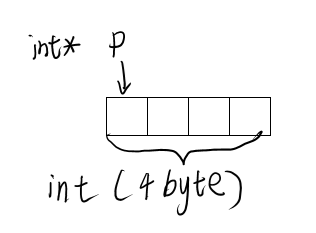
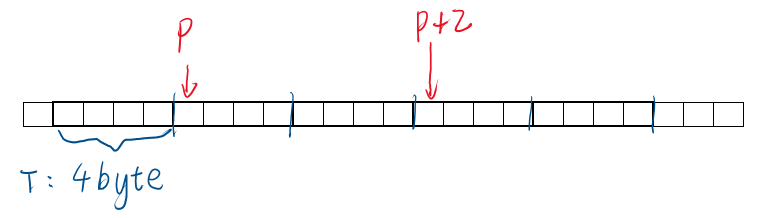
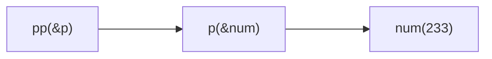

## 指针的基础用法

### 指针的类型

指针是一个4或8byte（取决于编译器）的变量，它能保存内存中**某一个**byte的地址。

变量或者对象在内存中存放时会占用多个byte，所以指针指向的是变量或者对象**起始的那个byte的位置**。



**指针也是有类型的**。

要操作指针所指向的内容时，会同时操作一片的内存。而指针的类型决定了要操作的内存的大小。

可以用`<类型名> *`描述指针的类型，指向`<type>`类型的**变量或数组**的指针类型都为`<type> *`

**指针也是有地址的。**

指针是一种特殊的变量，它首先是个变量，所以它本身是有地址的。

> `变量和类型.md`中有查看指针类型的代码

### 定义指针

`<type> * <name>`

这样就能定义一个`<type> *`类型的指针

假设`T`是一种类型，可以这么定义一个类型为`T *`的指针

```
T *p;
```

### 取值/取址符

当对一个指针使用取值符号（例如`*p`）时，读取内存中从`p`开始的**若干个字节**作为**类型T**。

取的字节数取决于**指针类型**的大小`sizeof(T)`

```cpp
// sizeof(T) = 4
T data; //变量
T *p = &data; //指针
T arr[N]; //数组
```

| 名称                      | 类型        | 大小                       |
| ------------------------- | ----------- | -------------------------- |
| `p`（指针）0              | `T *`       | 4或8 byte                  |
| `&data`（取址符）         | `T *`       | 4或8 byte                  |
| `*p`（取值符）            | `T`         | `sizeof(T)`                |
| `p[n]`，等同于`*(p+n)`    | `T`         | `sizeof(T)`                |
| `arr`（数组）             | `T [N]`     | `sizeof(T)*N`**（特殊!）** |
| `&arr`                    | `T (*) [N]` | 4或8 byte                  |
| `arr+0`（对数组整数操作） | `T *`       | 4或8 byte                  |

如果指针指向的**供使用的内存空间大小**和**指针类型大小**相同，则能正常工作。若不同，则操作指针时会**改变其它位置的内存**，可能**改动其它变量**或**直接崩溃**。

> 注意区分：
>
> - 在定义变量时，"`*`"跟着后面的变量名表示后面的变量为指针
> - 在表示类型时，"`*`"表示这是一个指针
> - 在表达式中，"`*`"用作取值运算符
> - 在`变量和类型.md`中有进一步的描述

> 总结：
>
> - `*`取值符号：取指针指向的变量，能被赋值（等号左右都能放）
> - `&`取址符号：取变量的内存地址
> - `[]`下标运算符：根据指针和下标取变量

### 运算

**不同类型的指针**虽然存放的都是内存地址，但不能互相赋值和比较，必须经过强制类型转换。

`NULL`可以被赋值给所有指针，其值=0，表示空指针

指针`p`加减整数`n`，表示将指针`p`向前或向后移动`n * sizeof(T)`。可以用自增或者自减。



## 指针特殊的用法

### void类型指针

可以定义void类型的指针。void表示无类型，下面的语句意思是定义一个没有说明类型的指针。

void指针**可以被任何类型的指针赋值**，**不能直接赋值给其它类型的指针**。

```cpp
void * p;
```

此时，`sizeof(p)=4`，由于`void`不表示具体类型，`sizeof(void)`未定义，对`p`取值时**不知道要操作多大的内存空间**，读取值后也不知道转换为声明类型。所以对于void类型的指针类似于下面的操作是不合法的：

```cpp
*p //类型是void，无具体类型，不合法
p+1 //sizeof(void)没定义，无法移向下一个位置，不合法
```

### 指针的嵌套

可以有`int **p;`这样的语句，表示指向指针的指针。甚至可以有`int *****p`这种东西。

```cpp
int num=233;
int *p=&num;
int **pp=&p;
cout<<**pp<<endl;
```

以上程序可以输出`233`。



### 函数指针

函数的代码在程序运行的时候被放在了内存的某个位置。可以定义**函数指针**并将其**指向某个函数**，然后通过**函数指针**调用**被指向的函数**。

```cpp
int max(int a,int b){return a>b?a:b;}
int main()
{
    int (* func)(int,int); //前面的括号必须有
    func=max; //函数名可以直接做指针
    cout<<func(2,3)<<endl;
}
```

`变量和类型.md`中详细描述了“复杂类型声明”问题。

### 对象的指针

```cpp
class T
{
    public:
        int a,b;
};
T data;
T * p = &data;
```

若要读取`p`指向的class内的元素的值，有两种方法：

```cpp
p->a;
(*p).a;//有优先级，不能省括号
```

### const与指针

```cpp
const int *p;
int const *p;
int *const p = &num;
```

前面两个表示`p`指向的是一个int类型的常量，即`*p`无法被赋值。

最后一个表示`p`是一个常量，即p存放的地址无法被修改。

## 数组和指针

### 疑问

> `arr==&arr`编译错误，提示：
>
> ```
> [Error] comparison between distinct pointer types `int*' and `int (*)[100]' lacks a cast`
> ```
>
> 感觉数组和指针还是有一点区别的？
>
> 运行以下代码：
>
> ```cpp
> 	arr[1]=1;
> 	cout<<arr[1]<<endl;
> 	cout<<(&arr)[1]<<endl;
> 	cout<<p[1]<<endl;
> ```
>
> 输出：
>
> ```cpp
> 1
> 0x64ff20
> 1
> ```
>
> 再运行以下代码
>
> ```cpp
> 	cout<<(&arr)[0]<<endl;
> 	cout<<(&arr)[1]<<endl;
> 	cout<<(&arr)[2]<<endl;
> ```
>
> 输出：
>
> ```
> 0x64fd90
> 0x64ff20
> 0x6500b0
> ```
>
> 根据编译器提示，
>
> ```cpp
> 	// arr	int*
> 	// &arr	int(*)[100]
> 	// *p	int*
> ```
>
> `int(*)[100]`是什么？为什么对`arr`取地址会得到这个？怎么方便的获得一个东西的类型？
>
> `*`与`&`到底修饰的是什么东西？
>
> 指针++又是什么意思？对指针加减是按字节修改还是按类型大小修改？
>
> 指针也有类型？指针的类型有什么用？怎么做类型转换？
>
> 对一个数组，指针的类型包不包括那个`[100]`？
>
> `sizeof()`对变量、数组、指针的区别？

过了一年我意识到，产生这些疑问，本质上是对C/C++的类型描述不清楚。

### 有关类型

`变量和类型.md`中详细描述了“复杂类型声明”问题。这里举几个简单的例子：

- `n`x`m`的二维数组`a`，元素类型为`T`：
  `T [n][m]`
- 对数组`a`取址
  `T (*) [n][m]`
- 直接对`a`进行指针操作
  `T * [m]`
- `n`x`m`的二维数组`b`，元素类型为`T *`：
  `T * [n][m]`
- 对数组`b`取址
  `T * (*) [n][m]`
- 直接对`b`进行指针操作
  `T * * [m]`

### 对数组名的几种操作

- `<name>`：直接对数组名进行sizeof等操作，求的是数组实际的大小
- `<name>`：对数组名进行任何指针操作，将进行**自动类型转换**，等同于操作**指向数组首元素的指针**(`&<name>[0]`)，同时维度-1
  - 一位数组：数组类型`<type> [n]`=>自动转换为`<type> *`（首元素为单个变量，指向首元素的为普通指针）
  - 多维数组：数组类型`<type> [n1][n2][nk]`=>自动转换为`<type> (*) [n2][nk]`（首元素为数组，指向首元素的为数组指针）
- `<name>[k]`：取数组第k位，实际为**指针后移k位取值**(`*(<name>+k)`)，同时维度-1
  - 一维数组：`<type> [n]`=>`<type>`
  - 多维数组：`<type> [n1][n2][nk]`=>`<type> [n2][nk]`
- `&<name>`：取**指向数组的指针**(`<type> (*) [n1][n2][nk]`)

### 数组作为函数参数

要向函数传递数组，可以有以下**等价**写法

```cpp
void func(int * arr);
void func(int arr[]);
void func(int arr[10]);

int arr[10];
func(arr);
```

这三种方式是等价的，编译器认为这都是`int *`类型的指针。

调用函数时只会将`arr`**作为指针**传递给`func`。函数内只能将`arr`参数**作为指针来处理**

> 函数声明中数组大小完全没有作用。
>
> 可以通过`sizeof(arr)`来验证，其值为4或8。

## 引用

### 概念

引用相当于**变量的别名**，是指针的语法糖。

在初始化之后**不能修改引用的指向**。

定义引用：`<类型名称> & <变量名>`

```cpp
int num = 233;
int & r = num; // r的类型为 int &
cout<<r<<endl; // 输出233
```

例子：

```cpp
void swap(int & a,int & b)
{
    int tmp=a;
    a=b;
    b=tmp;
}
```

### 作为函数类型

```cpp
int n = 4;
int & setvalue()
{
    return n;
}
int main()
{
    setvalue() = 40;
    cout<<n<<endl;
    return 0
}
```

输出`40`

在上面的例子中，由于函数返回`n`，可以将`setvalue()`整个看作`n`的引用，也就是`n=40`。

引用作为函数类型时不能返回函数内的局部变量。因为函数返回后，函数内的局部变量已经失效，其引用指向不确定的内存，会造成错误。

同理，指针也是这样，返回指针的时候，不能指向局部临时变量，否则指针将变为野指针