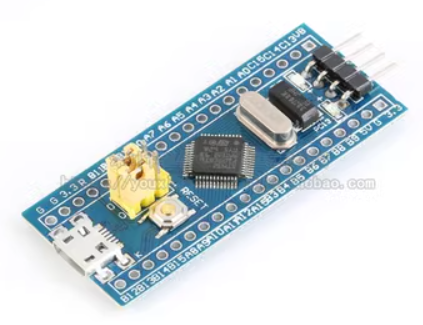
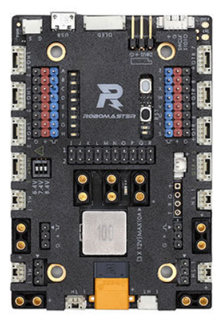
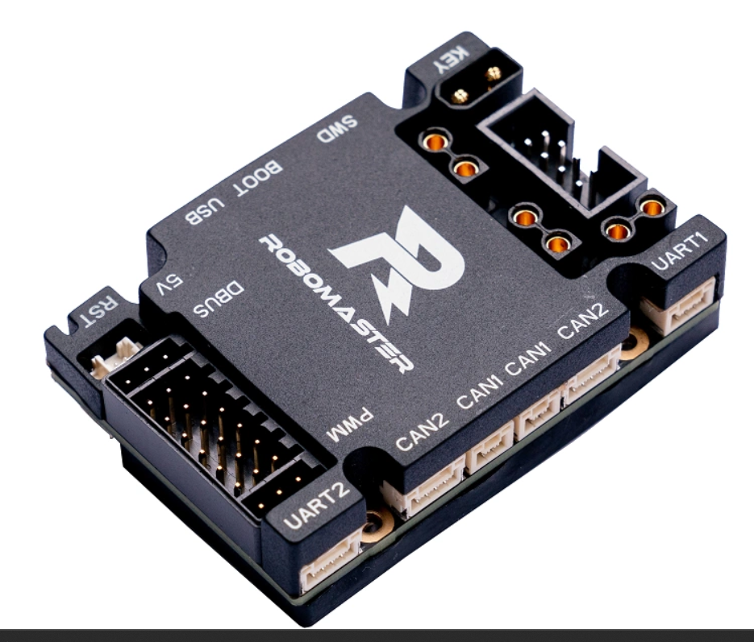
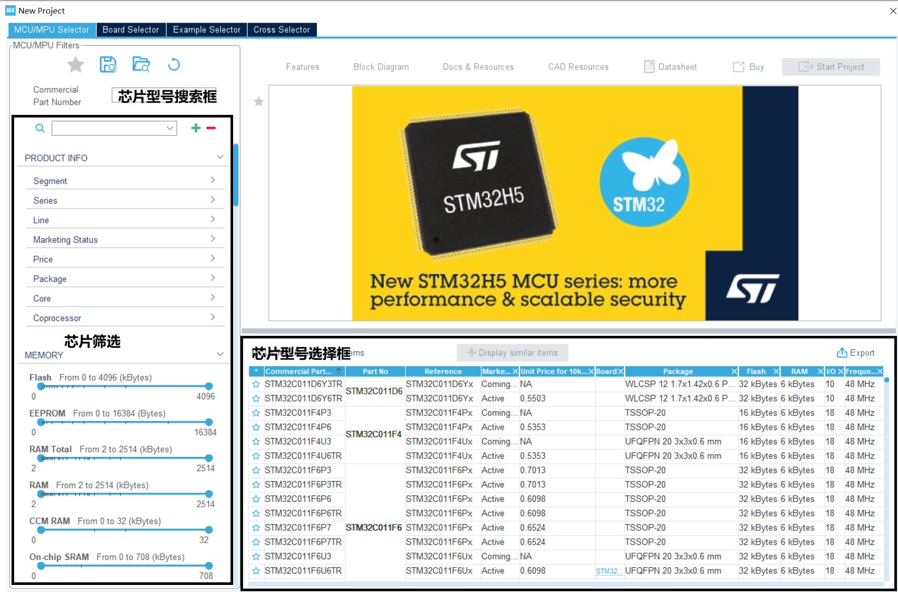
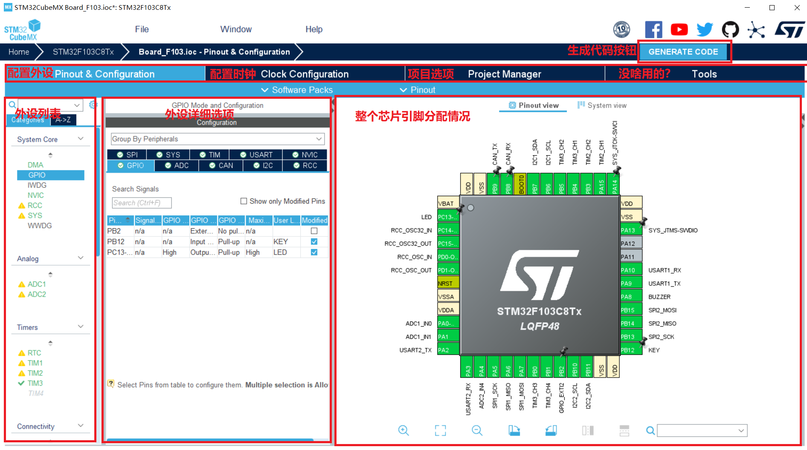
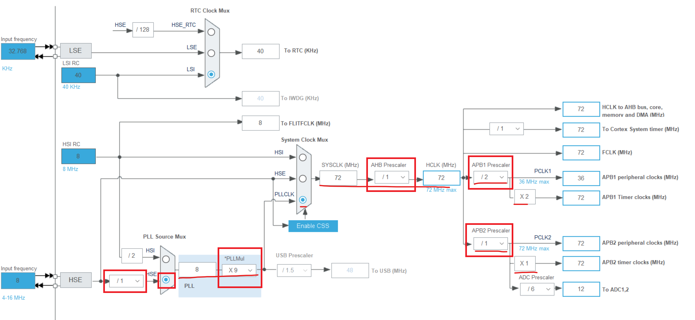

## 开发环境概述

这部分让你弄明白各个程序都是用来干嘛的。如果看不懂直接跳过，后面有疑惑再来看。

### 从代码到程序运行

1. 使用STM32CubeMX生成基础代码
2. 使用CMake生成编译指令并保存在文件中
3. 使用arm-none-eabi-gcc作为交叉编译器进行编译和链接
4. 使用OpenOCD调用下载器将二进制文件刷写到STM32中
5. 使用CLion作为GDB客户端连接到OpenOCD进行调试

### STM32CubeMX

- ST提供的工具
- 图形化配置时钟、外设、中断等等功能
- 自动复制各种库文件并且生成生成项目结构
- 生成外设的初始化代码，避免繁琐的手动初始化

### CMake

- 编译代码需要编译器，手动操作编译器比较麻烦，所以有人发明了CMake工具来自动调用编译器进行编译，简化环境配置
- 支持多平台、各种编译器
- 只负责生成编译文件和编译要用到的指令，可以调用编译器，不负责下载和调试

### 编译器

- 将代码转换为电脑可阅读的二进制文件
- 传统的Keil开发使用`Arm Compiler 5`
- 我们使用`arm-none-eabi-gcc`

### Clion

- JetBrains全家桶中的一个付费软件，适合进行嵌入式开发
- 可以自动生成CMake文件，也可以识别现有的CMake工程
- 负责调用CMake、编译器和OpenOCD

### OpenOCD

- 用于调用下载器下载和调试，可以调用ST-Link、DapLink、JLink等
- 只负责下载和调试，不负责编译
- 支持多种嵌入式芯片，包括我们用到的STM32F1/F4和其他各种各样的芯片
- 自身实现了GDB服务器功能，作为GDB服务器运行，Clion作为调试客户端连接以进行在线调试
- 安装包中自带调试器配置文件+芯片配置文件
- 对每种芯片+下载器，需要额外的一个配置文件来选择芯片/下载器种类，Clion中称为“**面板配置文件**”
- 需要在上述“面板配置文件”中引用安装包中自带的“调试器配置文件+芯片配置文件”，再额外添加自己的参数

## 开发环境搭建

1. 申请Jetbrains教育优惠，[申请链接](https://www.jetbrains.com/shop/eform/students)
2. 安装`Clion`，[下载链接](https://www.jetbrains.com/clion/download)
3. 安装`STM32CubeMX`，[下载链接](https://www.st.com/en/development-tools/stm32cubemx.html#get-software)，会给你发带链接的邮件
4. 安装`gcc-arm-none-eabi`并确保添加到系统Path，[下载链接](https://developer.arm.com/downloads/-/gnu-rm)
5. 安装`OpenOCD`并确保添加到系统Path，[下载链接](https://github.com/xpack-dev-tools/openocd-xpack/releases)

> 注意：
>
> - 从现在开始，挂上你的科学上网吧
> - 下载文件名称可能很长。选择系统带win字样的（也可能为linux等），同时架构带x64/x86_64字样的（也可能为arm64等）
> - 如何添加到系统Path请自行搜索解决

## 开发板介绍

开发板的需要关注的两个点：核心芯片，外围设备/接口的引脚分配

### 核心芯片

我们使用[STMicroelectronics](https://www.st.com/content/st_com/en.html)公司的STM32芯片，下面细分了各种各样不同系列不同型号的芯片。

我们使用最基础的`STM32F103C8T6`芯片作为教学，车上的开发板目前使用`STM32F407IGHx`系列的芯片（x表示任意字符）

### 引脚分配

开发板外围有一些基础的零件让芯片能正常运行起来，一般还会板载一些传感器/执行器接到芯片固定的某个引脚上，并且把芯片的一些特定功能的引脚引出来。

不同公司开发的开发板有不同的引脚分配，一般公司都会提供原理图。

> 比如开发板上的IIC2接口，包括四条线，线序是（GND/VCC/SCL/SDA），连接了STM32上的（SCL->PB6, SCK->PB7）

配置外设时需要阅读原理图，根据原理图分配引脚。

> 外设：芯片上的硬件控制器，通过外设可以更快的调用一些协议/接口/功能

### 开发板

| 名称       | 图片                                                         | 芯片          | 链接                                                         |
| ---------- | ------------------------------------------------------------ | ------------- | ------------------------------------------------------------ |
| F103核心板 |  | STM32F103C8T6 | https://stm32-base.org/boards/STM32F103C8T6-Blue-Pill.html   |
| 大疆A板    |  | STM32F407IGH6 | https://www.robomaster.com/zh-CN/products/components/general/development-board |
| 大疆C板    |  | STM32F427IIH6 | https://www.robomaster.com/zh-CN/products/components/general/development-board-type-c |

## 第一个空项目

### 大致流程

**CubeMX**

1. 新建工程
2. 选择芯片
3. 配置基本信息
4. 配置外设

**CLion**

1. 打开工程
2. 配置调试器
3. 写代码
4. 测试运行

### CubeMX配置

CubeMX新建工程时会提示选择芯片。

我们使用`STM32F103C8T6`和`STM32F407IGH6`

 

**界面介绍**

 

**基础配置**

打开Clock Cofiguration页面，如图配置时钟，一般需要配置划红线的地方

 

打开`Pinout & Configuration`页面，配置部分外设：

- `System Core` -> `RCC` -> `HSE`选`Crystal/Ceramic Resonator`
- `System Core` -> `SYS` -> `Debug`选`Serial Wire`

打开`Project Manager`页面，配置工程：

- `Project` -> `Project Settings`框 -> 填入项目名称
- `Project` -> `Project Settings`框 -> `Toolchain / IDE` 选STM32CubeIDE
- `Code Generator` -> `Generated Files`框 -> 勾上`Generate peripheral initialization as a pair of '.c/.h' files per peripheral`

**配置IO和外设**

后续的项目可以按需配置，作为第一个空项目没有要配置的东西

**生成代码**

点一下Generate Code按钮

### Clion配置

**打开工程**

切换回Clion，直接打开`.ioc`文件所在的目录，Clion会自动识别并新建工程，所有东西默认就好。

“面板配置文件”选择可以跳过，下面讲怎么手动添加

**配置调试器**

在右上角target框选编辑配置，新建`OpenOCD下载并运行`

选择CMake编译出来的二进制文件作为目标和OpenOCD调试用的“面板配置文件”

> - target框可以选择现在通过哪一种配置文件运行
> - target类型包括：“CMake应用程序”（调用CMake编译）或“OpenOCD下载并运行”（CMake编译并用OpenOCD下载）
> - “CMake应用程序”会自动加载所有CMakeLists.txt中的target和library
> - “OpenOCD下载并运行”需要选择待编译的CMake Target，OpenOCD当前使用的的下载和调试参数称为“**面板配置文件**”
> - 平时要刷固件，只用”OpenOCD下载并运行“，因为它会先调用CMake编译，再调用OpenOCD读取面板配置文件进行下载

这里提供几个我们用到的“面板配置文件”：

- DapLink + F103

  ```
  # choose st-link/j-link/dap-link etc.
  source [find interface/cmsis-dap.cfg]
  transport select swd
  # set FLASH_SIZE 0x100000
  ;set OPENOCD_FLASH_START 0x08000000
  source [find target/stm32f1x.cfg]
  # download speed = 10MHz
  adapter speed 10000
  ```

- DapLink + F407

  ```
  # choose st-link/j-link/dap-link etc.
  source [find interface/cmsis-dap.cfg]
  transport select swd
  # set FLASH_SIZE 0x100000
  ;set OPENOCD_FLASH_START 0x08000000
  source [find target/stm32f4x.cfg]
  # download speed = 10MHz
  adapter speed 10000
  ```

### 连接下载器

我们使用SWD调试，一般为四条线：DIO, CLK, VCC, GND

根据板子和下载器上印刷的字连接这四条线

### 下载和运行

编译/运行/调试图标都在右上角

## 工程结构介绍

### 目录介绍

目前我们只会用到：

- `Core/Inc` 用户头文件目录
- `Core/Src` 用户源文件目录，包含`main.c`主函数所在的文件

### 文件介绍

`Core/Src/main.c`

只关注`main`函数，其它东西先不管。程序从`main`函数开始运行。

可以看到`main`函数前面包含部分系统初始化代码，可以不用管它。关注**函数末尾的死循环**。现阶段我们只在循环里面写代码

对于CubeMX生成的文件，你只可以在一对BEGIN和END之间添加代码，CubeMX会**在下一次生成代码时把其余地方重置**。

```c
  /* USER CODE BEGIN WHILE */
  // √这里可以写自己的代码√
  while (1)
  {
    // √这里可以写自己的代码√
    /* USER CODE END WHILE */
      
    // ×这里不能写自己的代码×
      
    /* USER CODE BEGIN 3 */
    // √这里可以写自己的代码  √
  }
  // √这里可以写自己的代码√
  /* USER CODE END 3 */
```

