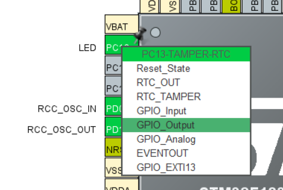

## 介绍

### GPIO是什么

- General-purpose input/output 通用输入输出接口
- 可以读取输入/控制输出低电平/高电平，对应0和1

### STM32中的GPIO

- 一个STM32有多个**GPIO端口**，用**大写字母标识**
- 一个GPIO端口(GPIO Port)引出了多个**引脚**，用**数字标识**
- 描述一个STM32引脚，应该表明他是**第几个GPIO端口的几号引脚**，记为"`P<端口编号><引脚编号>`"，如`PA8`表示(GPIO端口A的 第8号引脚)
- STM32中大部分引脚都可以被配置为GPIO接口，高电平为`3.3V`，低电平为`0V`

>这里有讲GPIO基本原理和一些基本电路的视频。只用看原理部分，不用看代码部分
>
>https://www.bilibili.com/video/BV1th411z7sn?p=5 (GPIO输出)
>
>https://www.bilibili.com/video/BV1th411z7sn?p=7 (GPIO输入)

## 实践：GPIO输出

### 目标

- 闪烁板载LED

### 配置CubeMX

可以把第一个空项目的.ioc文件复制出来改个名字再配置，不用每次都调那几个基本参数

根据电路图，STM32F103在核心板上`PC13`(GPIO 外设C 13号引脚)连接着板载led。

在CubeMX中的`Pinout & Configuration`页面，右侧的芯片图那里，将`PC13`引脚设置为`GPIO_Output`

可以右键给引脚添加`User Lable`，我将其设为"`LED`"

 

最后记得`Generate Code`

### 语法

用到的函数

```c
// 设置电平
void HAL_GPIO_WritePin(GPIO_TypeDef* GPIOx, uint16_t GPIO_Pin, GPIO_PinState PinState);
// 翻转电平
void HAL_GPIO_TogglePin(GPIO_TypeDef* GPIOx, uint16_t GPIO_Pin);
// 读取电平
GPIO_PinState HAL_GPIO_ReadPin(GPIO_TypeDef* GPIOx, uint16_t GPIO_Pin);
```

函数的参数

- `GPIO_TypeDef* GPIOx` GPIO端口，可取值为：
  - `GPIO<x>`
  - `<lable>_GPIO_Port`
- `uint16_t GPIO_Pin`：引脚在GPIO外设中的编号，可取值为
  - `GPIO_PIN_<ID>`
  - `<lable>_Pin`
- `GPIO_PinState PinState`：高低电平
  - `GPIO_PIN_RESET`：低电平
  - `GPIO_PIN_SET`：高电平

> `<lable>`表示之前设置的`User Lable`

### 代码

我们的代码从`main.c`的`int main()`开始运行。所以在主函数末尾的死循环中添加代码

```c
  /* Infinite loop */
  /* USER CODE BEGIN WHILE */
  while (1)
  {
        HAL_GPIO_WritePin(LED_GPIO_Port, LED_Pin, GPIO_PIN_SET);
        HAL_Delay(1000);
        HAL_GPIO_WritePin(LED_GPIO_Port, LED_Pin, GPIO_PIN_RESET);
        HAL_Delay(1000);
    /* USER CODE END WHILE */

    /* USER CODE BEGIN 3 */
  }
  /* USER CODE END 3 */
```

补充：`HAL_Delay()`用于延时，单位为毫秒。

## 实践：GPIO输入

### 目标

- 根据某引脚的高低电平控制LED的亮灭

### 配置CubeMX

根据原理图，我们开发板上的KEY按钮连接到`PB12`引脚。

所以和上面同理，把`PB12`引脚设置为`GPIO_Input`，并设置自己喜欢的`User Lable`，这里我使用"`KEY`"。

### 代码

用到的函数一起放在上面了

修改同样的位置

```c
  /* Infinite loop */
  /* USER CODE BEGIN WHILE */
  while (1)
  {
        GPIO_PinState pinstate = HAL_GPIO_ReadPin(KEY_GPIO_Port, KEY_Pin);
        HAL_GPIO_WritePin(LED_GPIO_Port, LED_Pin, pinstate);
    /* USER CODE END WHILE */

    /* USER CODE BEGIN 3 */
  }
  /* USER CODE END 3 */
```

## 其他

### 额外任务

可以自己尝试用按钮和灯实现一些功能，比如按下按钮点亮灯一秒再熄灭。

### 拓展-配置CubeMX

在Pinout & Configuration页面左侧选择System Core -> GPIO，可以详细配置GPIO

对输出引脚，有以下配置：

- GPIO output level: 默认输出的电平
- GPIO mode: 输出模式推挽/开漏，用不着但这里有详细的解释：https://www.bilibili.com/video/BV1D84y1c7GV/
- GPIO Pull-up/Pull-down: 内置上下拉，用不着
- Maximum output speed: 切换速度，如果要高速率IO口可以选择High，点灯这种就无所谓了
- User Lable: 用户标签

对输入引脚，有以下配置：

- GPIO Pull-up/Pull-down: 内置上下拉，这里有详细的解释：https://www.bilibili.com/video/BV1Kb411o7ai/
- User Lable: 用户标签

我们的开发板有外置的上拉，所以用KEY的时候选择不上拉/下拉

