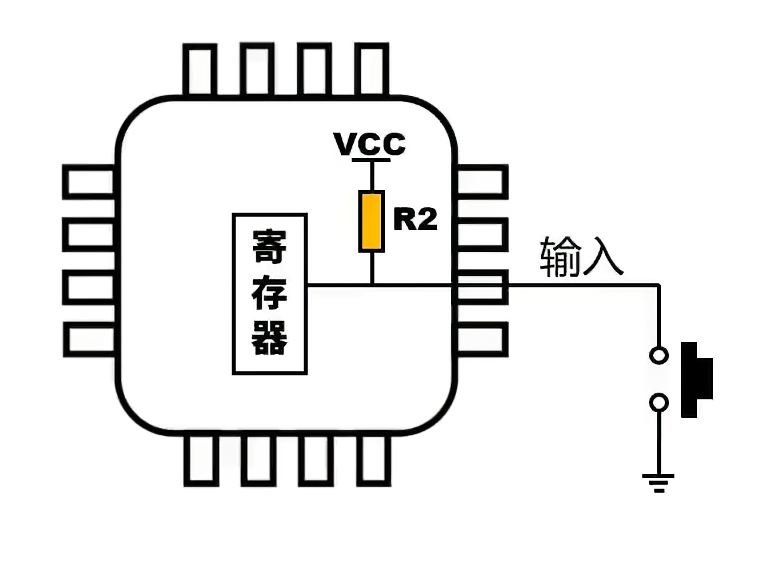

## 介绍

### GPIO是什么

- General-purpose input/output 通用输入输出接口
- 可以读取输入/控制输出低电平/高电平，对应0和1

### STM32中的GPIO

- 一个STM32有多个**GPIO端口**，用**大写字母标识**
- 一个GPIO端口(GPIO Port)引出了多个**引脚**，用**数字标识**
- 描述一个STM32引脚，应该表明他是**第几个GPIO端口的几号引脚**，记为"`P<端口编号><引脚编号>`"，如`PA8`表示(GPIO端口A的 第8号引脚)
- STM32中大部分引脚都可以被配置为GPIO接口，高电平为`3.3V`，低电平为`0V`

>这里有讲GPIO基本原理和一些基本电路的视频。只用看原理部分，不用看代码部分
>
>https://www.bilibili.com/video/BV1th411z7sn?p=5 (GPIO输出)
>
>https://www.bilibili.com/video/BV1th411z7sn?p=7 (GPIO输入)

## 实践：GPIO输出

### 目标

- 闪烁板载LED

### 配置CubeMX

可以把第一个空项目的.ioc文件复制出来改个名字再配置，不用每次都调那几个基本参数

根据电路图，STM32F103在核心板上`PC13`(GPIO 外设C 13号引脚)连接着板载led。

在CubeMX中的`Pinout & Configuration`页面，右侧的芯片图那里，将`PC13`引脚设置为`GPIO_Output`

可以右键给引脚添加`User Lable`，我将其设为"`LED`"

 

最后记得`Generate Code`

### 代码

我们的代码从`main.c`的`int main()`开始运行。所以在主函数末尾的死循环中添加代码

```c
  /* Infinite loop */
  /* USER CODE BEGIN WHILE */
  while (1)
  {
        HAL_GPIO_WritePin(LED_GPIO_Port, LED_Pin, GPIO_PIN_SET);
        HAL_Delay(1000);
        HAL_GPIO_WritePin(LED_GPIO_Port, LED_Pin, GPIO_PIN_RESET);
        HAL_Delay(1000);
    /* USER CODE END WHILE */

    /* USER CODE BEGIN 3 */
  }
  /* USER CODE END 3 */
```

补充：`HAL_Delay()`用于延时，单位为毫秒。

> 你可能注意到驱动PC13 LED灯时，引脚电平状态与LED开关状态“相反”。这是因为最小系统板上LED的正极与vcc直接相连，当引脚设为高电平时，引脚端呈现高阻态，LED中无电流通过，因此熄灭。引脚设为低电平时，电流（正电荷记法）通过LED流向引脚端，LED点亮。 --Sequen4e


## 实践：GPIO输入

### 目标

- 根据某引脚的高低电平控制LED的亮灭

### 接线

我们使用PB12引脚作为按键输入

**上拉&下拉**

如果仅使用STM32核心板：

- 需要手动连接开关。使用开关将PB12引脚和GND之间连接起来。

- 需要<u>额外配置芯片内置的上拉电阻</u>，解释参考文章末尾

   

扩展板上的按键KEY有外置的上拉，所以用KEY输入的时候选择不上拉/下拉。

> 在上拉模式下，内部上拉电阻将引脚连接到电源电压（VDD），使引脚在未连接外部信号时保持高电平。当你将开关的一端连接到引脚，另一端接地时，开关断开时，引脚通过上拉电阻保持高电平；当开关闭合时，引脚被拉低到地电平（GND）
>
> -- 凛娴

### 配置CubeMX

根据原理图，我们开发板上的KEY按钮连接到`PB12`引脚。

所以和上面同理，把`PB12`引脚设置为`GPIO_Input`，并设置自己喜欢的`User Lable`，这里我使用"`KEY`"。

视具体使用情况，可选配置上拉或者下拉`GPIO Pull-up/Pull down`

### 代码

用到的函数一起放在上面了

修改同样的位置

```c
  /* Infinite loop */
  /* USER CODE BEGIN WHILE */
  while (1)
  {
        GPIO_PinState pinstate = HAL_GPIO_ReadPin(KEY_GPIO_Port, KEY_Pin);
        HAL_GPIO_WritePin(LED_GPIO_Port, LED_Pin, pinstate);
    /* USER CODE END WHILE */

    /* USER CODE BEGIN 3 */
  }
  /* USER CODE END 3 */
```

## 其他

### HAL库语法

用到的函数

```c
// 设置电平
void HAL_GPIO_WritePin(GPIO_TypeDef* GPIOx, uint16_t GPIO_Pin, GPIO_PinState PinState);
// 翻转电平
void HAL_GPIO_TogglePin(GPIO_TypeDef* GPIOx, uint16_t GPIO_Pin);
// 读取电平
GPIO_PinState HAL_GPIO_ReadPin(GPIO_TypeDef* GPIOx, uint16_t GPIO_Pin);
```

函数的参数

- `GPIO_TypeDef* GPIOx` GPIO端口，可取值为：
  - `GPIO<x>`
    比如`GPIOA`, `GPIOB`
  - `<lable>_GPIO_Port`
    比如`LED_GPIO_Port`, `KEY_GPIO_Port`
- `uint16_t GPIO_Pin`：引脚在GPIO外设中的编号，可取值为：
  - `GPIO_PIN_<ID>`
    `GPIO_PIN_0`, `GPIO_PIN_1`
  - `<lable>_Pin`
    比如`LED_Pin`, `Key_Pin`
- `GPIO_PinState PinState`：高低电平
  - `GPIO_PIN_RESET`：低电平
  - `GPIO_PIN_SET`：高电平

> `<lable>`表示之前设置的`User Lable`，填写UserLable后再Generate Code，CubeMX会自动在文件里生成对应名称的宏，用起来较为方便

### 额外任务

可以自己尝试用按钮和灯实现一些功能，比如按下按钮点亮灯一秒再熄灭。

### 拓展-配置CubeMX

在Pinout & Configuration页面左侧选择System Core -> GPIO，可以详细配置GPIO

对输出引脚，有以下配置：

- GPIO output level: 默认输出的电平
- GPIO mode: 输出模式推挽/开漏
- GPIO Pull-up/Pull-down: 内置上下拉
- Maximum output speed: 切换速度，如果要高速率IO口可以选择High，点灯这种就无所谓了
- User Lable: 用户标签

对输入引脚，有以下配置：

- GPIO Pull-up/Pull-down: 内置上下拉
- User Lable: 用户标签

> - 关于推挽/开漏： https://www.bilibili.com/video/BV1D84y1c7GV/
> - 关于上拉/下拉： https://www.bilibili.com/video/BV1Kb411o7ai/

