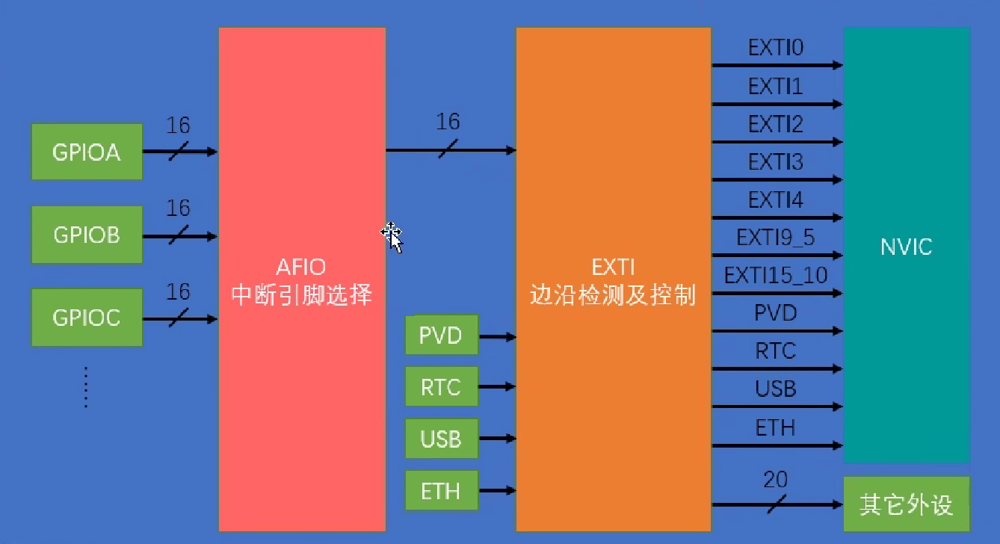
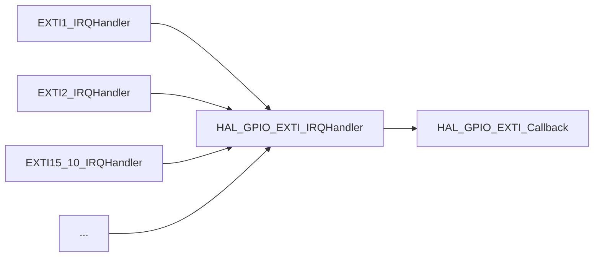
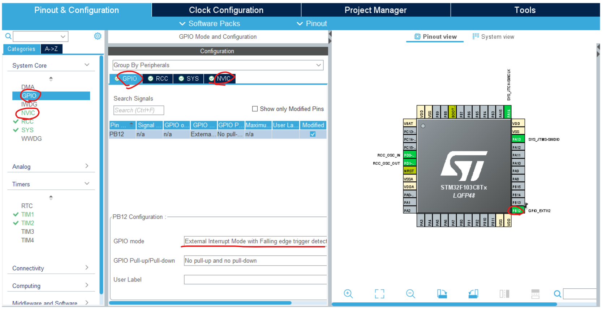

## 介绍

### 什么是中断

> 在嵌入式系统中，我们经常需要响应外部事件。例如，当按下按钮时，我们需要点亮 LED。在这种情况下，我们需要在主循环中不断读取按钮状态。这被称为轮询。但是，这种方法并不高效。我们可以使用中断来解决这个问题。
>
> 中断是一种机制，它允许 CPU 及时响应外部事件。<u>当发生外部事件时，CPU 将停止当前任务并执行相应的中断服务例程</u>。执行中断服务例程后，CPU 将返回原始任务。
>
> 因此，我们可以使用中断来响应外部事件。例如，当按下按钮时，我们可以使用中断来点亮 LED。
>
> 但是，中断服务例程中的程序应尽可能简单。这是因为当发生中断时，CPU 将停止当前任务。如果中断服务例程太长，CPU 将花费太多时间在中断服务例程上，主任务将无法及时执行。这将导致系统崩溃。
>
> By GPT

### 外部中断EXTI

> 原理教程：https://www.bilibili.com/video/BV1th411z7sn?p=11

EXTI外部中断主要用于在引脚的电平改变时产生中断，避免轮询读取引脚电平，节省CPU时间。

### 架构

 

- 每个 GPIO Port 连接了16个 GPIO Pin
- 所有 GPIO Port 接到AFIO上，AFIO在ID相同Port不同的Pin之间选择，相同ID不同Port之间的Pin只能选择一个连接到EXTI
- 边沿改变 或 触发代码 触发EXTI，把触发的来源记录到请求挂起寄存器
- EXTI 产生 通往NVIC的中断 或 通往其它外设的事件驱动其他外设产生动作
- 由于资源不足，部分EXTI通往NVIC的引脚被合并，NVIC无法分辨中断来自哪个具体引脚
- 最后NVIC中断CPU，调用中断函数

### 中断的产生过程

> 该部分需要一定的”计算机结构“相关的知识

假设我们需要尽可能快地得知按钮的状态，所以使用中断的方式来读取

1. 用户按下按钮，将某个PIN拉低

2. 硬件电路产生中断

   1. 通过**AFIO中断引脚选择器**选择某一个GPIO Port上的引脚
   2. 低电平在**EXTI中断控制器**中依次通过<u>边沿检测</u>、<u>引脚中断使能</u>等电路
   3. EXTI通过<u>11根线</u>通知**NVIC嵌套向量中断控制器**，NVIC产生<u>对应编号</u>的中断

3. CPU处理中断

   1. 保存当前正在运行的程序的数据（寄存器、栈空间等）

   2. 根据中断编号和预先加载到内存的**中断向量表**(`startup_stm32f103xb.s`)得到**中断服务程序ISR**函数的地址
      对于按键产生的EXTI外部中断，中断向量表有11个条目，对应11个ISR函数

      > 中断向量表对于每个芯片是固定的，里面有多个条目，每个条目记录一种中断所对应的ISR的地址

   3. 跳转到**中断服务程序ISR**函数(`stm32f1xx_it.c`)的地址并运行

   4. 在使用HAL库和CubeMX生成代码时，在ISR中调用HAL库对应外设的`HAL_xxxxxx_IRQHandler`函数
      比如按键产生的EXTI外部中断就是调用<u>HAL库中GPIO外设的`HAL_GPIO_EXTI_IRQHandler`</u>（11种ISR函数调用同一个HAL库函数）
      使用HAL库开发时，我们不应该在此处添加应用逻辑。

   5. HAL库的`HAL_GPIO_EXTI_IRQHandler`函数(`stm32f1xx_hal_gpio.c`)内部自动处理好各种寄存器

   6. HAL库调用<u>用户级的回调函数`HAL_GPIO_EXTI_Callback(uint16_t GPIO_Pin)`</u>
      这个用户级回调函数为[弱符号](https://www.cnblogs.com/linhaostudy/p/9237357.html)(`weak`)，用户应该<u>编写同名的函数，在别处覆写系统内置的默认函数</u>，在其中处理应用逻辑

   > **弱符号**指的是定义中包含`weak`的函数和变量。比如如下函数：
   >
   > ```c
   > weak void HAL_GPIO_EXTI_Callback(...)
   > {
   >  // Do nothing in weak function
   > }
   > ```
   >
   > 在C中是不能定义两个相同名称的符号的。但是如果一个是强符号而另一个是弱符号，编译过程中的<u>链接步骤会丢掉弱符号而保留强符号</u>
   >
   > 这种用法通常用在模块的接口上。比如STM32的HAL库，其中包含每个用户级回调函数的弱定义。用户只需要在其它地方定义同名函数，链接时就会自动覆盖了。



## 实践: 外部触发中断


### 目标

使用中断的方式，在按下按钮时切换板载LED的亮灭

### 接线

参考上一章

### 配置CubeMX

可以把第一个空项目的.ioc文件复制出来改个名字再配置，不用每次都调那几个基本参数

1. 在CubeMX中的`Pinout & Configuration`页面
   1. 右侧的芯片图那里，将`PB12`引脚设置为`GPIO_EXTI12`
   2. 最左侧外设列表 `System Core` -> `GPIO`项
      1. 已经默认选择的`GPIO`页 -> 选中`PB12`
         1. `GPIO mode`选择<u>下降沿触发的中断</u> （如果仅使用STM32核心板）
         2. 视具体使用情况，可选配置上拉或者下拉`GPIO Pull-up/Pull down`，参考上一章
      2. 中间选择`NVIC`页 -> 启用`EXIT line[15:10] interrupts`
         (或者在最左侧的外设列表中选择 `System Core` -> `NVIC`项 -> 中间 启用`EXIT line[15:10] interrupts`)
   3. 别忘了按照之前的教程额外配置LED的GPIO输出




### 代码

我们在`main.c`里覆写中断回调函数`HAL_GPIO_EXTI_Callback`，发生中断后hal会自动调用此函数

在`main`函数前面的位置添加代码

```c
/* Private user code ---------------------------------------------------------*/
/* USER CODE BEGIN 0 */
void HAL_GPIO_EXTI_Callback(uint16_t GPIO_Pin)
{
    if (GPIO_Pin == GPIO_PIN_12)
    {
        HAL_GPIO_TogglePin(LED_GPIO_Port, LED_Pin);
    }
}
/* USER CODE END 0 */
```

### 运行

理论上，运行时开关按下的瞬间，灯会点亮或熄灭。

但是由于没有添加足够的**防抖机制**，按下和松开的瞬间会有多个电平跳变，导致在按下和松开时触发多次中断，导致亮灭状态不可控。（至少我手上的板子是这样的）

可以自行了解按钮防抖机制

## 总结

### 注意

**关于中断的回调函数**

不可以在回调函数中执行耗时的操作！比如等待 (`HAL_Delay`)或者大量的计算

本章最开始有说明，<u>相同ID不同Port之间的Pin只能选择一个连接到EXTI</u>。所以在回调函数中不能分辨外部中断来自哪一个Port。

**关于Volatile**

这一点在后面才会使用得到，但是在这里提前说明。

> volatile 关键字是一种类型修饰符，用它声明的类型变量表示可以被某些编译器未知的因素更改，比如：操作系统、硬件或者其它线程等。遇到这个关键字声明的变量，编译器对访问该变量的代码就<u>不再进行优化</u>。系统<u>总是重新从它所在的内存读取数据</u>，而不是从缓存或者寄存器中读取，即使它前面的指令刚刚从该处读取过数据。

多个线程或者中断中需要访问的变量，都需要加上`volatile`关键字。比如：

```c
volatile int num;
```

### 代码调用层次

1. 在STM32中，中断请求由外设发出到达NVIC指定中断通道，NVIC中断CPU并调用`Core/Src/stm32f1xx_it.c`中**对应通道的中断函数**`xxx_IRQHandler`
2. 同一外设的`xxx_IRQHandler`调用`stm32f1xx_hal_xxx.c`中**同一个寄存器处理函数**`HAL_xxx_IRQHandler`，让HAL库处理寄存器
3. 处理完寄存器后会**按照中断类型**调用`stm32f1xx_hal_xxx.c`**对应的用户中断回调弱函数**`HAL_xxx_Callback`，**用户覆写此弱函数**来在中断时执行操作

> 在Clion中，你可以<u>按住键盘上的Ctrl键，再用鼠标左键点击函数名</u>，以追踪函数的声明或定义。
>
> 你可以尝试阅读上述两个文件中的三种函数，加深对中断的理解

> `stm32f1xx_it.c`中有多个EXTI中断函数，因为中断向量表中设计了多个条目。以前使用LL库开发时，在此文件中手动设置各种寄存器并实现应用逻辑。现在使用HAL库就不用在这里面写代码了。

