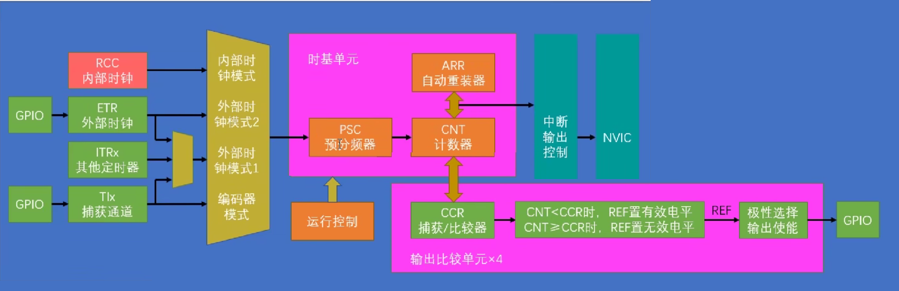
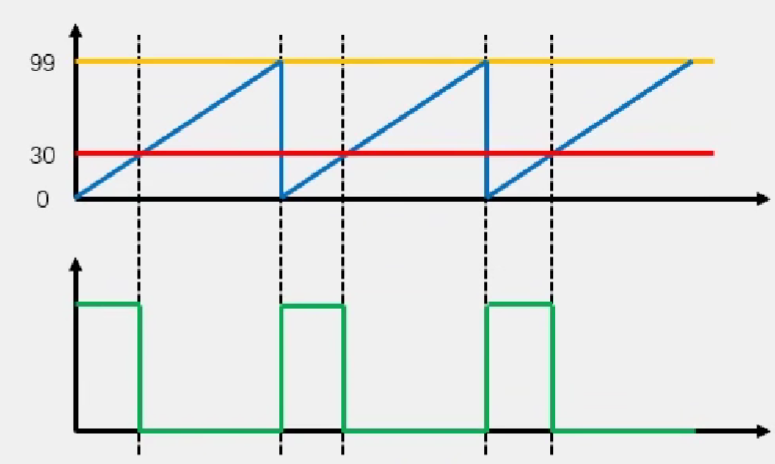
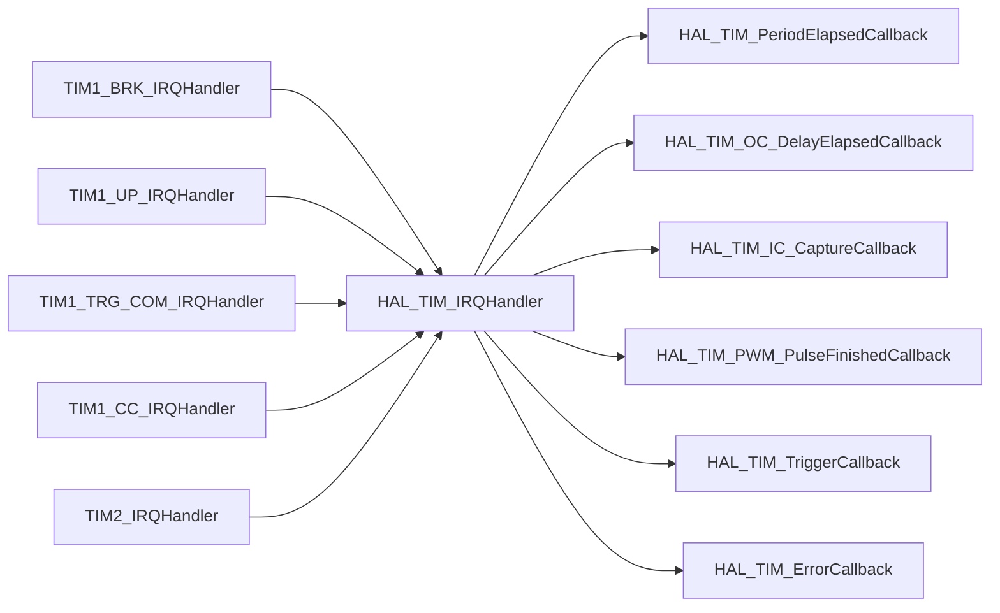
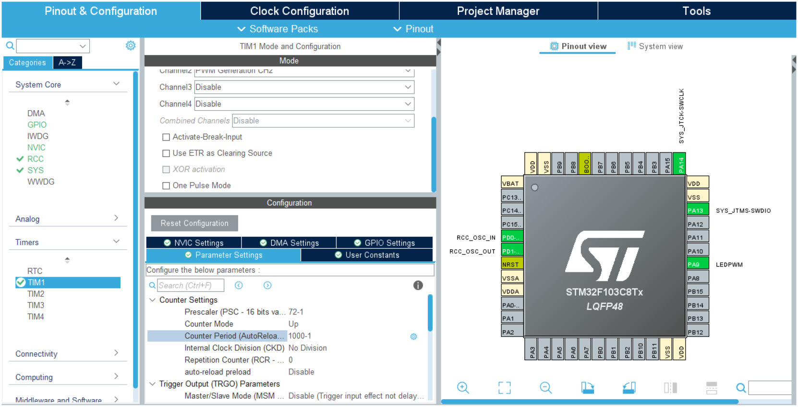
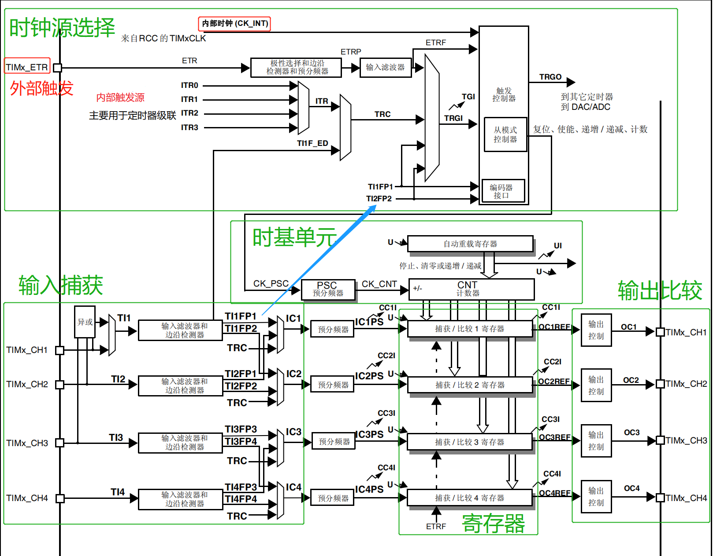

## 介绍

### Timer是什么

- 可配置的硬件定时器
- 常用的功能：
    - 在到时间时触发更新中断，调用特定的程序代码
    - 在到时间时发生更新事件，触发特定的硬件功能
    - 利用比较功能输出任意占空比和频率的方波

> 原理这里就不详细写了，自己去看教程
>
> - 定时器简介： https://www.bilibili.com/video/BV1th411z7sn?p=13
> - PWM和输出比较功能： https://www.bilibili.com/video/BV1th411z7sn?p=15
> - 另一篇文字教程： https://deepbluembedded.com/stm32-pwm-example-timer-pwm-mode-tutorial/

### Timer外设

定时器按参数和功能也分为多种（基本定时器，通用定时器，高级定时器），这里用一个通用计时器单元举例



**结构**

- 时钟输入源：内部时钟、GPIO外部时钟、其它定时器等
- 时基单元（计数器）：向上计数(每次+1)，向下计数(每次-1)，中央对齐(轮流向上向下计数)
- <u>四个</u>比较/捕获通道：用于PWM/输出比较/输入捕获功能

**每个通道支持的模式**

- 输出比较：比较 <u>定时器的CNT计数寄存器</u> 和 <u>通道的CCR比较寄存器</u> 决定输出高电平和低电平，用来输出PWM波形
- 输入捕获：收到输入的信号时 将 定时器的CNT计数寄存器 转存到 通道的CCR比较寄存器，用来测量外部信号频率和占空比
- 编码器模式：利用输入捕获 测量编码器的旋转速度

### 如何计时

**时钟**

以STM32F103为例：

1. 时钟输入源：选择"内部时钟"时，来源于时钟树的 APBx Timer clocks（不同的定时器会分别挂载在APB1/APB2下）
2. 时钟经过<u>预分频器</u>，频率变为输入源的 `1/(PSC+1)`
3. 时钟进入<u>时基单元</u>，进行计数。计数达到上限时，清零计数器，重新开始计数

**三个寄存器**

- 预分频寄存器 `TIMx_PSC`（Prescaler, 频率系数）
- 自动重装载寄存器 `TIMx_ARR` （Auto Reload Register, 计数上限）
- 计数器寄存器 `TIMx_CN`（Counter, 计数变量）

**计数过程**

1. `TIMx_PSC`表示预分频器将输入频率变慢到几分之一
2. 分频后的每个周期，`TIMx_CN`向上计数
3. `TIMx_CN` == `TIMx_ARR` 时产生溢出。清零`TIMx_CN`，重新从0开始计数

> 相当于 `for (int TIMx_CN=0; TIMx_CN<=TIMx_ARR; TIMx_CN++)`
>
> 由于从0开始计数，注意<u>需要计数n次时`TIMx_ARR`=n-1</u>

**频率计算**

$频率 = \frac{输入源频率} {(预分频器系数 \times 计数上限)}$

### 如何输出PWM



一个寄存器：

- 比较寄存器 `TIMx_CCRx`

定时器处于PWM输出模式下时：

- `TIMx_CNT` < `TIMx_CCRx`，输出一种电平

- `TIMx_CNT` > `TIMx_CCRx`，输出另一种电平

计数到`TIMx_ARR`，计数寄存器自动归零

可以通过控制每个通道的`TIMx_CCRx`和`TIMx_ARR`的比例控制占空比

`TIMx_ARR`越大，占空比的控制就越精细

### HAL库

**启用/禁用定时器**

```c
// 开始/停止定时器时基单元
HAL_StatusTypeDef HAL_TIM_Base_Start(TIM_HandleTypeDef *htim);
HAL_StatusTypeDef HAL_TIM_Base_Stop(TIM_HandleTypeDef *htim);

// 开始/停止定时器时基单元，并允许相关的中断
HAL_StatusTypeDef HAL_TIM_Base_Start_IT(TIM_HandleTypeDef *htim);
HAL_StatusTypeDef HAL_TIM_Base_Stop_IT(TIM_HandleTypeDef *htim);
    
// 启动/停止单个通道的pwm输出（自动启动时基单元）
HAL_StatusTypeDef HAL_TIM_PWM_Start(TIM_HandleTypeDef *htim, uint32_t Channel);
HAL_StatusTypeDef HAL_TIM_PWM_Stop(TIM_HandleTypeDef *htim, uint32_t Channel);
```

**访问寄存器**

可以通过新版/旧版的`__HAL`宏读写寄存器，也可以直接通过指针访问寄存器，都是等价的

为了让代码更加规范，请使用新版的HAL库宏（名称仅包含大写单词和下划线的）

```c
// 定时器n的预分频器
__HAL_TIM_SET_PRESCALER(__HANDLE__, __PRESC__);
/*
htimn.Instance->PSC;
*/

// 定时器n的计数寄存器
__HAL_TIM_SET_COUNTER(__HANDLE__, __COUNTER__);
__HAL_TIM_GET_COUNTER(__HANDLE__);
/*
__HAL_TIM_SetCounter(__HANDLE__, __COUNTER__);
__HAL_TIM_GetCounter(__HANDLE__);
htimn.Instance->CNT;
*/

// 定时器n的自动重装载寄存器（计数上限）
__HAL_TIM_SET_AUTORELOAD(__HANDLE__, __AUTORELOAD__);
__HAL_TIM_GET_AUTORELOAD(__HANDLE__);
/*
__HAL_TIM_SetAutoreload(__HANDLE__, __AUTORELOAD__);
__HAL_TIM_GetAutoreload(__HANDLE__);
htimn.Instance->ARR; 
*/

// 定时器n通道m的比较寄存器
__HAL_TIM_SET_COMPARE(__HANDLE__, __CHANNEL__, __COMPARE__);
__HAL_TIM_GET_COMPARE(__HANDLE__, __CHANNEL__);
/*
__HAL_TIM_SetCompare(__HANDLE__, __CHANNEL__, __COMPARE__);
__HAL_TIM_GetCompare(__HANDLE__, __CHANNEL__);
htimn.Instance->CCRm;
*/
```

## 实践1: 定时器触发中断

> 视频教程： https://www.bilibili.com/video/BV1th411z7sn?p=13
>
> 文字教程： https://deepbluembedded.com/stm32-counter-mode-example-frequency-counter-timer-in-counter-mode/

### 提供的中断

```c
/* stm32f1xx_hal_tim.c
@verbatim
  ==============================================================================
                        ##### TIM Callbacks functions #####
  ==============================================================================
 [..]
   This section provides TIM callback functions:
   (+) TIM Period elapsed callback
   (+) TIM Output Compare callback
   (+) TIM Input capture callback
   (+) TIM Trigger callback
   (+) TIM Error callback
*/
```

ToDo

### 代码调用层次 *

> 为了能让大家更加熟悉STM32的中断功能，这里再用Timer描述一遍中断的发生过程，介绍后面的外设时就不再描述了

TIM中断到达NVIC后，将会调用`Core/Src/stm32f1xx_it.c`中的**特定定时器的特定中断**的`TIMx_xx_IRQHandler()`函数。用户可以在这里添加处理代码，我们不修改这里

上述函数中调用HAL库文件`stm32f1xx_hal_tim.c`中的**同一个HAL内置函数**`HAL_TIM_IRQHandler(TIM_HandleTypeDef *htim)`读取中断产生的寄存器，判断是哪一种中断，我们不修改这里

上面HAL库处理完寄存器后，自动调用HAL库文件`stm32f1xx_hal_tim.c`中定义的**不同类型的中断弱回调函数**`HAL_TIM_xxxCallback(TIM_HandleTypeDef *htim)`，建议利用此函数，在别处覆写此弱函数处理中断。

> - 有的定时器只提供一个总的中断进入NVIC，所以`stm32f1xx_it`中只有一个总的`TIMx_IRQHandler`函数，
> - 有的定时器每种类型的中断分别进入NVIC，所以`stm32f1xx_it`中有很多分的`TIMx_xx_IRQHandler`函数
> - 以前使用LL库开发时，在`stm32f1xx_it`文件中手动设置各种寄存器并实现应用逻辑。现在使用HAL库就不用在这里面写代码了。



### 语法

```c
// 启动整个定时器，并且启用中断功能
HAL_StatusTypeDef HAL_TIM_Base_Start_IT(TIM_HandleTypeDef *htim);

// 停止整个计时器，并且停用中断功能
HAL_StatusTypeDef HAL_TIM_Base_Stop_IT(TIM_HandleTypeDef *htim);
```

### 目标

利用定时器中断，实现亮500ms，灭500ms闪烁的LED

### 配置CubeMX

我们使用`TIM1`实现

配置`TIM1`并启用中断：

- 最左侧外设列表 Timers -> TIM1 -> 中间上方Mode
  - Clock Source 选择Internal Clock （配置时钟源）
- 最左侧外设列表 Timers -> TIM1 -> 中间下方Configuration -> Parameter Settings页面
  - Counter Settings -> 设置Prescaler （配置预分频器）
  - Counter Settings -> 设置Conter Period （配置重装载寄存器）
  - PWM Generation Channel x -> Pulse （配置比较寄存器，这个程序不用设置）
- 最左侧外设列表 Timers -> TIM1 -> 中间下方Configuration -> NVIC Settings页面 
  - 勾上TIM1 update interrupt （启用定时器溢出中断，普通定时器只有一个global interrupt）

别忘记启用LED的GPIO输出

### 代码

和上面相似我们在`main.c`里覆写中断回调函数`HAL_TIM_PeriodElapsedCallback`，定时器超时后后hal会自动调用此函数

在`main`函数前面的位置添加代码

```c
/* Private user code ---------------------------------------------------------*/
/* USER CODE BEGIN 0 */
void HAL_TIM_PeriodElapsedCallback(TIM_HandleTypeDef *htim)
{
    if (htim->Instance == TIM1)
    {
        HAL_GPIO_TogglePin(LED_GPIO_Port, LED_Pin);
    }
}
/* USER CODE END 0 */
```

在`main`函数的`while`前面添加代码，以中断方式启动一次定时器

```c
  /* Infinite loop */
  /* USER CODE BEGIN WHILE */
    HAL_TIM_Base_Start_IT(&htim1);
  while (1)
  {
    /* USER CODE END WHILE */

    /* USER CODE BEGIN 3 */
  }
  /* USER CODE END 3 */
```

### 运行

运行代码，你应该能看到闪烁的LED

## 实践2: 呼吸灯

### 目标

用核心板板载led实现呼吸灯，即缓慢点亮缓慢熄灭不断循环

### 原理

通过Timer输出**PWM**波形，修改波形的**占空比**以改变乐一地的亮度。

> 有关PWM和占空比请自行谷歌资料

### 连接LED

由于板载LED并没有直接连接到硬件定时器上，只能通过跳线的方式将LED的引脚连接到某个硬件定时器的输出引脚上。

我这里使用跳线把扩展板上的`PC13`和`PA9`连接到了一起，也就是把LED连接到了`TIM1`的`Channel2`上。

### 配置CubeMX

可以把第一个空项目的.ioc文件复制出来改个名字再配置，不用每次都调那几个基本参数

在CubeMX中的`Pinout & Configuration`页面，右侧的芯片图那里，将`PA9`引脚设置为`TIM1_CH2`

配置`TIM1`以及它的`Channel2`：

- 最左侧外设列表 Timers -> TIM1 -> 中间上方Mode
  - `Clock Source` 选择`Internal Clock` （配置时钟源）
  - `Channel2` 选择`PWM Generation CH2` （配置通道信息）

- 最左侧外设列表 Timers -> TIM1 -> 中间下方Configuration -> Parameter Settings页面
  - Counter Settings
    - 设置`Prescaler` （配置预分频器）
    - 设置`Conter Period` （配置重装载寄存器）

  - PWM Generation Channel 2
    - `Pulse` （这个是配置比较寄存器，这里不做设置，会在代码中动态修改）


预分频器、重装载寄存器和比较寄存器的值请尝试自行计算。

这里我使用`1000hz`的PWM频率，`1000`的脉宽精细度

> 注意：由于定时器从0开始计数，实际计数上限需要-1。预分频器和定时器本质上都是计数器，所以在CubeMX中填入类似于n-1的值

 

记得点`Generate Code`

### 代码

和之前一样，修改`main.c`

```c
    /* Infinite loop */
    /* USER CODE BEGIN WHILE */

    // 开始定时器单个通道的pwm输出
    HAL_TIM_PWM_Start(&htim1, TIM_CHANNEL_2); 

    while (1)
    {
        int i;
        
        // 比较寄存器的值缓慢递增
        for (i = 0; i < 1000; i += 5)
        {
            __HAL_TIM_SET_COMPARE(&htim1, TIM_CHANNEL_2, i);
            HAL_Delay(1);
        }
        
        // 比较寄存器的值缓慢递减
        for (i = 1000; i > 0; i -= 5)
        {
            __HAL_TIM_SET_COMPARE(&htim1, TIM_CHANNEL_2, i);
            HAL_Delay(1);
        }
        
        /* USER CODE END WHILE */

        /* USER CODE BEGIN 3 */
    }
    /* USER CODE END 3 */
```

### 运行

你应该看到乐一地亮度在不停的变化

## 实践3: 蜂鸣器

### 目标

驱动扩展板上的蜂鸣器发声

### 原理

通过Timer输出方波，修改波形**频率**以改变蜂鸣器的音高。

440hz为音符A5的频率，可以先尝试只发出一个音符

这里使用midi音符编号(midikey)来标记音符，可以通过特定的表达式计算特定音符的频率。

```c
freq = 440*pow(2,(midikey-69)/12.0);
```

### 配置CubeMX

配置CubeMX和呼吸灯的操作非常类似，主要是代码上的区别。

可以把第一个空项目复制一份改个名字，不用每次都调那几个基本参数

在CubeMX中的`Pinout & Configuration`页面，右侧的芯片图那里，将`PA8`引脚设置为`TIM1_CH1`

配置`TIM1`以及它的`Channel1`：

- 最左侧外设列表 Timers -> TIM1 -> 中间上方Mode 
  - Clock Source 选择`Internal Clock`
  - Channel1 选择`PWM Generation CH1`
- 左侧外设列表 Timers -> TIM1 -> 中间下方Configuration -> Parameter Settings页面
  - Counter Settings -> 设置`Prescaler` 预分频器
  - Counter Settings -> `Conter Period` 重装载寄存器，这里不做设置在代码中修改
  - PWM Generation Channel 1 -> `Pulse` 比较寄存器，这里不做设置在代码中修改

我在Prescaler中填入了72-1，在预分频后可以得到1MHz的频率，通过在程序中动态改变重装载寄存器的值，可以获得15Hz以上的音高

记得点`Generate Code`

### 代码

添加计算频率用的`math.h`头文件

```c
/* Private includes ----------------------------------------------------------*/
/* USER CODE BEGIN Includes */
#include "math.h"
/* USER CODE END Includes */
```

新定义一个`singtone`函数以播放单个音符，添加在`main`函数之前

```c
/* Private user code ---------------------------------------------------------*/
/* USER CODE BEGIN 0 */
void singtone(int midikey, int time)
{
    // 计算频率
    int freq = 440*powf(2,(midikey-69)/12.0);
    // 计算arr和cmp
    int arr = 1000000/freq;
    int cmp = arr/2;
    // 重置上一个音符的累计数值(坑)
    __HAL_TIM_SetCounter(&htim1, 0);
    // 设置频率
    __HAL_TIM_SetAutoreload(&htim1, arr-1);
    __HAL_TIM_SetCompare(&htim1, TIM_CHANNEL_1, cmp-1);
    // 播放音符
    HAL_TIM_PWM_Start(&htim1, TIM_CHANNEL_1);
    HAL_Delay(time);
    HAL_TIM_PWM_Stop(&htim1, TIM_CHANNEL_1);
}
/* USER CODE END 0 */
```

> 注意：如果切换音符时不重置累计数值，如果ARR'<ARR，且恰好ARR'<CNT<ARR，计数器已经超过当前计数上限，则CNT不会自动重置，只能等待其计数到溢出后从0重新计数，所以会导致发声停顿。

由于只在启动时播放一次，播放音符的代码就写在`main`函数的while外面吧。

```c
  /* Infinite loop */
  /* USER CODE BEGIN WHILE */
    singtone(72, 200); // C6 200ms
    singtone(74, 200); // D6 200ms
    singtone(79, 200); // G6 200ms
    while (1)
    {
    /* USER CODE END WHILE */

    /* USER CODE BEGIN 3 */
    }
  /* USER CODE END 3 */
```

### 运行

你应该听到大疆设备经典的启动声音

## 更高级的用法

### 参考文档

> - Timer文档：AN4013 Introduction to timers for STM32 MCUs
>    https://www.st.com/resource/en/application_note/an4013-introduction-to-timers-for-stm32-mcus-stmicroelectronics.pdf

### 输入输出源的选择



**时钟输入源 Clock Source**

- 内部时钟 `CK_INT`
  来自 APB timer clock
- 外部引脚 `ETR2`
  引出到芯片外部的 `TIMx_ETR` 引脚
- 在 `External Clock Mode 1` 下由触发信号 `TRGI` 作为时钟
  `TRGI` 信号的来源是可以配置的

**触发输入信号来源 `TRGI`** (Slave Mode 配置)

- 外部引脚 `ETR1`
  引出到芯片外部的 `TIMx_ETR` 引脚
- 其它定时器 `ITRx `
  每个定时器的 `ITRx` 输入都连接到一个特定定时器的 `TRGO` 输出上，具体需要查datasheet
- 通道输入极性 `TIxFPx`
  引出到芯片外部的 `TIMx_CHx` 引脚经过<u>滤波</u>和<u>极性选择</u>的信号
- 通道输入边沿 `TIxF_ED`
  引出到芯片外部的 `TIMx_CHx` 引脚经过<u>滤波</u>和<u>极性选择</u>的<u>边沿信号</u>

> 参考自RM0090的`TIMx_SMCR`从模式选择

**触发输出信号来源 `TRGO`** (Master Mode 配置)

- 复位：`TIMx_EGO`->`UG` （`UG`位由软件写1时重置计数器并生成更新事件）
- 使能：`CNT_EN` （定时器使能）
- 更新：发生更新事件时（向上/向下计数到达末端，或者重置）产生脉冲
- 比较脉冲：`OCx` 当发生捕获或比较成功时产生脉冲
- 比较：`OCxREF`使用某一通道的输出比较电平作为触发输出

> 参考自RM0090的`TIMx_CR2`控制寄存器

**发生中断/DMA请求**

- 计数器发生更新（溢出、初始化）：`UI`, `UD`
- 触发事件（计数器启动、停止、初始化）：`TI`, `TD`
- 输入捕获/输出比较（捕获/比较寄存器=计数器）：`CCxI`, `CCxD`

> 参考自RM0090的`TIMx_DIER`中断使能寄存器

**我的总结**

> **一些事件的名词**
>
> - 复位事件：软件写入`TIMx_EGO`的`UG`位进行复位（初始化）
> - 溢出事件：向上/向下计数到达边沿时
> - 更新事件：复位事件 或 溢出事件 发生时
> - 捕获/比较事件：计数器=捕获/比较寄存器时
> - 触发事件：`TRGI`发生时

### 更多的HAL函数

> 这些启停函数命名方式为：`HAL_TIM_功能_Start/Stop_附加功能()`
>
> - 功能包含：`Base`(公共时基单元), `PWM`(单个通道PWM), `IC`(单个通道输入捕捉), `OC`(单个通道输出比较), `Encoder`(单个通道编码器功能), 
> - 附加功能可以选：`_IT`(启用当前功能的中断请求), `_DMA`(启用当前功能的DMA请求)
>
> 虽然这些函数不是互相独立的，但是可以认为这些函数在常用的情况下不会互相干扰。

**回调函数**

记得在NVIC处使能中断，同时以中断模式启动定时器

``` c
// 定时器发生溢出时调用
__weak void HAL_TIM_PeriodElapsedCallback (TIM_HandleTypeDef *htim);

// 输出比较模式下，比较事件发生时调用（值相等时）
__weak void HAL_TIM_OC_DelayElapsedCallback (TIM_HandleTypeDef *htim);

// 输入捕捉模式下，捕捉事件发生时调用（）
__weak void HAL_TIM_IC_CaptureCallback (TIM_HandleTypeDef *htim);

// PWM模式下，一个脉冲周期完成时调用
__weak void HAL_TIM_PWM_PulseFinishedCallback (TIM_HandleTypeDef *htim);

// TRGI事件发生时调用（TRGI信号来源可以配置）
__weak void HAL_TIM_TriggerCallback (TIM_HandleTypeDef *htim);

// 发生错误时调用
__weak void HAL_TIM_ErrorCallback (TIM_HandleTypeDef *htim);
```

>  https://os.mbed.com/teams/Senior-Design-Sound-Monitor/code/STM32L4xx_HAL_Driver/docs/tip/group__TIM__Exported__Functions__Group9.html


