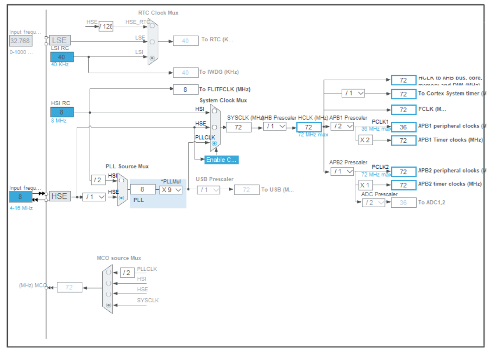
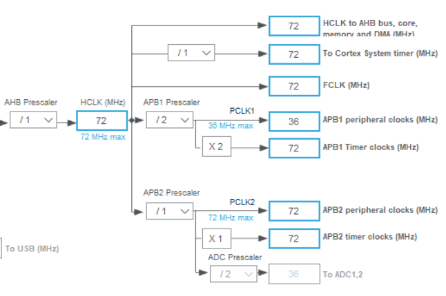
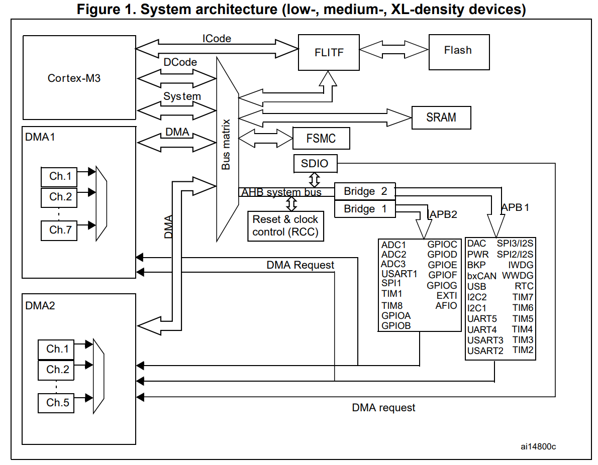
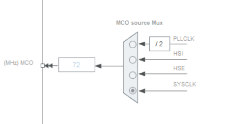
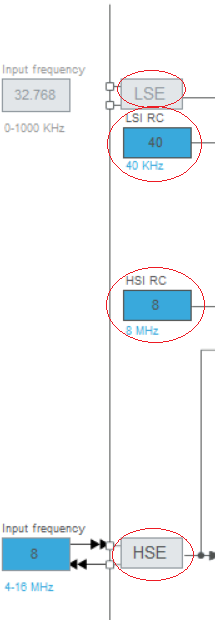
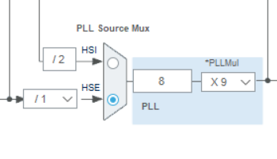

### 时钟

时钟信号是微控制器内部和外部设备同步工作的基础，是现代所有计算机的“心跳”。几乎每个操作和数据传输都依赖时钟信号来确保步骤的协调。没有稳定的时钟，系统会出现不可靠的行为。

逻辑电路中，

- **组合逻辑电路**（Combinational Logic Circuit）  
    单纯由逻辑门组成的电路
- **时序逻辑电路**（Sequential Logic Circuit）  
    在组合逻辑电路之上添加时钟，让单片机的不同部分互相同步。它允许电路存储状态，使得计算机（微控制器）能够被通过寄存器等时序元件实现的状态机描述。

在stm32芯片中**各种设备的运作都需要时钟驱动**，为了减少开发人员的工作量，CubeMX将**与时钟有关的关键配置以时钟树图的形式表现出来**，方便开发人员进行查看与修改。

### RCC与时钟树

RCC指stm32的时钟系统控制器，整个时钟树都可以视为它的一部分（或者说被它控制），我们对时钟树的所有配置本质上都是在配置RCC。

配置时钟树说到底还是为了配置需求时钟的各个设备以及满足设计上的要求，因此配置时钟树实际上是在利用组成时钟树的各个设备与系统得到需求的目标。

### 时钟树的关键部分

#### 输入源：振荡器

> 单片机振荡器典型频率在40KHZ到20MHZ之间，高性能单片机晶振频率能够到达1GHZ。
>
> 现代时钟一般由RC振荡器与晶体振荡器（简称晶振）生成。
>
> **RC振荡器**是一种使用电阻与电容交错网络生成周期性信号的组件，其**精度与稳定性较差，但结构简单并且成本低廉**。一般**集成在单片机芯片内部**
>
> **晶振**是一种使用压电效应晶体（如石英晶体）所制成的振荡器。压电效应晶体值在被施加电压时会产生微小震动的晶体，其频率由晶体的尺寸和形状决定。**晶振通常有较高的稳定性**，这使得晶振在需要高精度和稳定性的应用中很常见。由于其性能特征与尺寸相关，小型化相对困难，因此**一般以单独元件的形式外接到单片机**。

#### 频率加倍：PLL锁相环

PLL的主要作用是同步并稳定输入进来的信号。PLL会提取信号的一部分，将参考信号与反馈信号进行比对，输出基于二者生成的信号。一类特殊的PLL可以将反馈信号进行分频处理，从而使得生成的信号频率更高，这便是倍频时钟生成用途的PLL，也就是我们所讨论的PLL。**时钟生成用途的PLL最主要的功能就是处理频率与精度有限的时钟源，输出频率更高，更稳定的时钟信号。**

> [!NOTE]
>
> PLL是一种复杂的电子反馈控制系统，其用途有很多，在f103最小系统板开发中我们只考虑其时钟生成的用途。
>
> 有关PLL详细工作原理：https://www.bilibili.com/video/BV1aX4y1A747/?spm_id_from=333.337.search-card.all.click&vd_source=1a452d9c016e540fe60c06331a29e23a

#### 高速时钟需求：AMBA架构与AHB，APB总线

**AMBA架构**

- **AMBA**（Advanced Microcontroller Bus Architecture):  
  ARM架构中所定义的一套总线结构，旨在提高系统的性能与可拓展性。

- **AHB**（Advanced High-performance Bus):  
  负责<u>高性能模块</u>之间的互联，比如CPU、DMA等

- **APB**（Advanced Peripheral Bus):  
  <u>低带宽的周边外设</u>之间的连接，比如GPIO、UART、定时器等低速外设。  

**APB总线**

STM32F1上有两条APB总线(APB1, APB2)

|     外设     |            APB1            |  APB2   |
| :----------: | :------------------------: | :-----: |
|    定时器    |   TIM2，TIM3，TIM4，TIM5   |  TIM1   |
| 串行外设接口 | USART2，USART3，I2C1，I2C2 | USART1  |
|     GPIO     |             /              | GPIOA~E |
|   外部中断   |             /              |  EXTI   |
|     其他     |   WWDG，IWDG，SPI2，RTC    |    /    |

以下图片在`RM0008`的`Memory and bus architecture` > `System architecture`一节中

#### 外部时钟输出：MCO外部时钟输出

支持将时钟树不同部分的时钟输出出来，使用时需要从RCC开启。

> [!TIP]
>
> MCO的输出端连接到GPIO，它可以通过PA8（STM32F103C8T6）输出时钟。这使得你可以通过该设备让系统共用同一个时钟，或者部分监测芯片内时钟的状态。

### 图形化的时钟树

- **箭头**：指示连接方式
- **方框**：此处的频率，<u>仅用于CubeMX的计算</u>，以MHz为单位
  - 蓝色背景的方框：输入的震荡源的频率，<u>需要人工指定</u>
  - 蓝色边框的方框：用以<u>快速配置时钟树</u>，简化开发人员的工作流程。可以在此输入你期望的频率，系统会自动求解
  - 黑色的方框：CubeMX根据配置<u>推导得到的频率，不可修改</u>

- **梯形**：多路复用器（MUX），需要人工指定，用途为从多个输入中选择一个作为输出，通常是从左（输入）往右（输出）。

- **下拉框**：分频器或者锁相环的系数，<u>需要人工指定</u>，用于将频率加倍。这是物理硬件上的某个寄存器，软件使用下拉框的形式限制配置方式来简化工作，运行时会实际地写入设备

### 配置时钟树

> [!IMPORTANT]
>
> 本模块旨在提供配置stm32f103c8t6最小系统板的一系列步骤清单。因此这个清单与stm32f103c8t6最小系统板强耦合。任何硬件或软件的拓展与变更都可能导致该清单内容不可用，具体情况具体对待。

> [!NOTE]
>
> 官方配置教学：https://www.youtube.com/embed/_oZTNCZbQ_M?rel=0&autoplay=1&cc_load_policy=1&list=PL8n_tqwYdzVDE2e7v8m0oTV6F9SYQFeqL

**0. 明确需求**

一般而言预期频率的考量因素有如下几种：

1. 定时器与看门狗（特殊定时器）需求的特殊频率以精确计算时间
2. 与单片机连接的外设（慢速存取设备，ADC等）需要特定频率工作
3. 功耗因素（一般为降低功耗）
4. 多单片机开发或分布式开发
5. 某些特殊情况下的多线程
6. Debug或其他开发需求

**1. 启用时钟源**

- HSE <u>高速外部时钟</u>：**主要使用的时钟源**，唯一能够获得72MHz最高主频的时钟源。最灵活的时钟源，能够通过输入的信号进行输出频率的调整。如果没有特殊理由基本使用该时钟源。<u>需要在`Pinout & Configuration`的`RCC`中开启才能使用。</u>
- HSI <u>高速内部时钟</u>：不稳定，Debug或者外部晶振损坏时临时使用，或作为特殊用途的时钟信号另外使用（<u>如输出到HSE或输出到MCO</u>）。
- LSE <u>低速外部时钟</u>：适合**需要使用RTC（需要记录时间或日期）的场景**。需要在`Pinout & Configuration`的`RCC`中开启才能使用。
- LSI <u>低速内部时钟</u>：不稳定，Debug或者外部晶振损坏时临时使用。<u>IWDG仅能使用该时钟源。</u>

**2. 使用自动计算功能推导**

CubeMX时钟树中蓝色方框即为能够直接输入预期频率的方框，当系统简单的时候可以尝试直接向这些方框内输入想使用的时钟频率，软件会自动计算并给出可能的一种配置方案。

但这种方法不太稳定，有时软件会给出不正确的方案，又或者将系统其他部分的配置打乱。这时就需要手动配置了

**3. 手动配置MUX、PLL、分频器**

软件自动求解的方案可能有偏差，需要仔细检查并手动调试。

如果系统能以更高效率完成工作（比如预期的频率或精度要求要远低于目前正在使用的解决方案），那么考虑优化系统。

> [!TIP]
>
> 在选择好时钟源并使用PLL倍频后，后续所有设备所使用的频率均不能超过你使用PLL所得到的频率。并且大部分设备的预分频器只能对输入的频率做有限的分频，其参数配置也可能并不与期望相符。因此在配置时钟树时，先查看目标设备的时钟需求和预分频器参数，再计算需求的频率。

> [!TIP]
>
> PLL仅连接了两个高速震荡源，通过这两个震荡源所最高能够生成的时钟频率分别为64MHZ与72MHZ。虽然PLL最高能将输入进来的频率×16（HSE频率×16=8×16=128mHZ），但因为stm32f103芯片各个设备的限制，系统主频最高能够接受的频率为72MHZ，因此在选用HSE进行输入时，PLLMul寄存器最高值为×9。

最后，USB时钟仅链接PLL，想要使用USB必须要开启PLL。

**可能遇到的问题**

<u>标注为红色的方框</u>代表没有线路可以到达此处，自动求解无法给出配置方案，或此处的值超出容忍的范围。

<u>标注为灰色的方框</u>代表软件判断此处的配置毫无意义而禁止用户配置（如设备未开启时）。

> [!NOTE]
>
> 上述关于软件中更多描述时钟树状态的方式与标注参考CubeMX上方的help->Tutorial video.

> [!TIP]
>
> 如果有任何部分“配置不了”或“报错”，请仔细检查。<u>你很有可能会发现是多路复用器（MUX）的选择出错或是某个设备没有开启/使能。</u>

