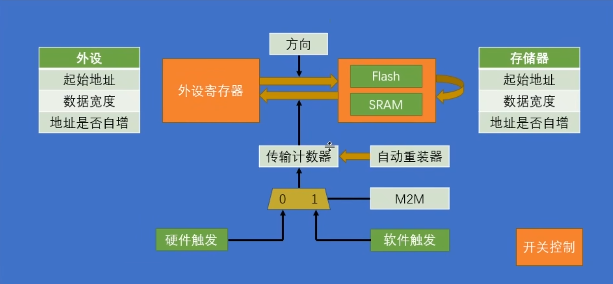

## 介绍

### 什么是DMA

- Direct memory access 直接内存访问
- 需要连续的搬运大量数据时可以代替CPU进行操作

### 架构

 

- 触发源 M2M：
  - 硬件触发：触发一次启动单次转运，每个DMA通道有固定的几个硬件触发源，任意一个（或的关系）都可以触发一次转运
  - 软件触发：触发一次启动一轮转运，时钟驱动转运，直到传输计数器为0，不能和循环模式同时使用
- 传输计数器：转运次数，每次转运发生自减，减为0时重置转运地址为起始地址
- 自动重装器：转运完一轮，传输计数器减为0时，是否重置传输计数器为最初值，自动开始下一轮，即Circular Mode循环模式
- 方向：官方叫“外设到存储器”和“存储器到外设”和“存储器到存储器”，本质上都是某地址到某地址
- 源/目标：
  - 起始地址：转运起始地址
  - 数据宽度：一次转运几个bit，byte (8bit), half word (16bit), word (32bit)
  - 地址是否自增：每次转运同个地址，还是依次转运一批地址，即每次转运完就指针p++

## 实践：软件触发的内存到内存DMA

参考ST官方教程

ToDo
