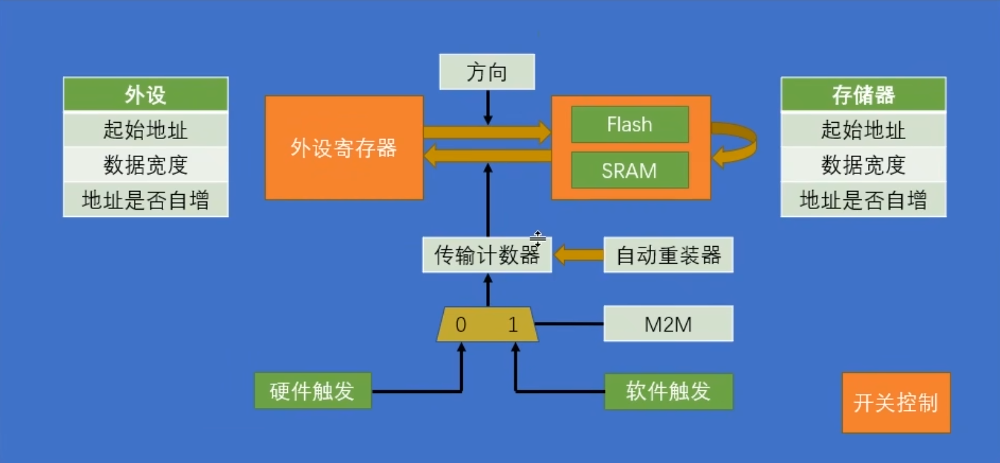
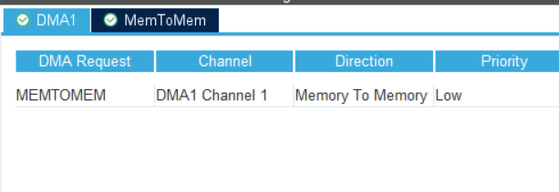

## 介绍

### 什么是DMA

- Direct memory access 直接内存访问
- 需要连续的搬运大量数据时可以代替CPU进行操作

> 教程：https://www.bilibili.com/video/BV1th411z7sn?p=23

### 架构

 

- 触发源 M2M：
  - 硬件触发：触发一次启动单次转运，不同的外设连接到不同的DMA通道上，当硬件外设发生了指定事件时就触发一次转运（比如从UART收到了一字节的数据，ADC完成了一次数据采集，后面的章节有）
  - 软件触发：触发一次启动一轮转运，时钟驱动转运，直到传输计数器为0，不能和循环模式同时使用（通过代码调库启用一次转运）
- 传输计数器：转运次数，每次转运发生自减，减为0时重置转运地址为起始地址
- 自动重装器：转运完一轮，传输计数器减为0时，是否自动重置传输计数器为最初值开始下一轮，即Circular Mode循环模式
- 方向：官方叫“外设到存储器”和“存储器到外设”和“存储器到存储器”，本质上都是某地址到某地址（外设的寄存器映射到地址空间上，通过访问内存的方式直接访问外设寄存器）
- 源/目标：
  - 起始地址：转运起始地址
  - 数据宽度：一次转运几个bit
  - 地址是否自增：每次转运同个地址，还是依次转运一批地址，即每次转运完就指针p++

## 实践：软件触发的内存到内存DMA

### 目标

使用代码触发一次DMA转运，使用DMA将内存中的数据直接传输到另一片内存中

### 轮询模式和中断模式

- 轮询模式：调用阻塞的函数`HAL_DMA_PollForTransfer`，库函数内部通过循环不停的检查DMA硬件是否完成传输
- 中断模式：需要手动注册中断函数，DMA完成转运后会自动调用函数

我们仅介绍中断模式

### 配置CubeMX

我们还没有学习串口数据输出，所以通过LED灯来展示数据是否成功转运。

按照之前的教程配置LED的引脚

**配置DMA通道**



在`System Core` -> `DMA`外设内<u>添加通道，选择`MEMTOMEM`内存到内存的转运</u>

这一次我们传输的数据类型为`uint32_t`(无符号32位整数类型`unsigned 32bit integer`)，<u>`Data Width`选项需要选择对应的选项</u>

> 数据位宽
>
> - <u>byte</u> (8bit)
> - <u>half word</u> (16bit)
> - <u>word</u> (32bit)

**配置DMA中断**

代码调用HAL库函数启动一次DMA转运后，用户代码继续在前台执行，DMA在后台搬运数据，不占用CPU资源。

DMA将<u>所有数据搬运完后，将会产生中断来通知CPU。</u>

在`System Core` -> `NVIC`外设中，启用DMA的中断

### 代码

**示例输入数据**

将这部分代码放到main函数上方来获得示例的输入输出数据

```c
#define BUFFER_SIZE 32
uint32_t srcBuffer[BUFFER_SIZE] = {1, 2, 3, 4, 5, 6, 7, 8, 9, 10, 11, 12, 13, 14, 15, 16, 17, 18, 19, 20, 21, 22, 23, 24, 25, 26, 27, 28, 29, 30, 31, 32};
uint32_t dstBuffer[BUFFER_SIZE] = {0};
```

**定义并注册中断回调函数**

将下列代码放在main函数上方，定义中断处理函数。

DMA完成传输时调用`HAL_DMA_ConvCpltCallback`，判断确实是DMA1通道1完成传输后，我们将`DMAcpltFlag`置为1，表示传输成功。

注意，**中断中使用的变量务必使用`volatile`关键字**

> `volatile`关键字让编译器每次使用时都从内存中读取值，而不是将值缓存在寄存器中。请自行了解相关问题。

```c
//DMA complete flag
volatile uint8_t DMAcpltFlag = 0;

//DMA interrupt funcs
void HAL_DMA_ConvCpltCallback(DMA_HandleTypeDef *hdma)
{
    if (hdma == &hdma_memtomem_dma1_channel1)
        DMAcpltFlag = 1;
}
```

DMA中断需要注册回调函数。在`main`函数初始化的过程中使用以下代码

```c
hdma_memtomem_dma1_channel1.XferCpltCallback = HAL_DMA_ConvCpltCallback;
```

> [!TIP]
>
> 所有中断函数返回后，都会回到MCU中断之前执行的位置。

**代码**

```c
// 开始非阻塞的DMA传输
HAL_DMA_Start_IT(&hdma_memtomem_dma1_channel1, (uint32_t)srcBuffer, (uint32_t)dstBuffer, BUFFER_SIZE);

// 此时可以执行其它任务。我们没有其它任务，所以使用while等待中断
while (DMAcpltFlag == 0);

// 传输完成，可以下断点观察数据
while (1);
```

本次实验使用while来等待DMA传输完成，实质上等于轮询。实际开发中MCU可以去执行其他任务，尽量避免这样使用轮询浪费计算资源。

**检查结果**

使用<u>动态调试</u>的方法检查结果是否正确。

在DMA传输前后下断点，启动动态调试，观察到数据已经被拷贝到目标内存。

