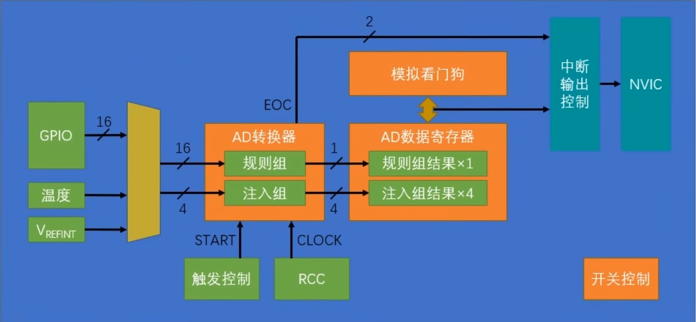

## 介绍

### ADC是什么

- Analog to Digital Converter 模拟数字转换器
- 简单理解：读取引脚上的电压值
- 输入范围：0~3.3V(VDDA)
- 转换结果：12bit，0~4095

> https://www.bilibili.com/video/BV1th411z7sn?p=21

### 转换模式

- 规则模式：有一个**顺序表**，可以提前设置好**一轮转换中按顺序依次读取**哪些channel。后面都是使用此模式。
- 注入模式：可以插队优先转换，在RM比赛中用不着，所以本文不做介绍

### HAL库

我们在RM中的的需求很简单，只需要用到最简单的“开始->转换第一项->停止”的模式就行

```c
// 构造adc选项参数结构体，设置adc规则模式转换列表的第一项Rank 1
ADC_ChannelConfTypeDef sConfig = {0};
sConfig.Channel = channel;
sConfig.Rank = ADC_REGULAR_RANK_1; // 扫描模式关闭时，列表中只有第一个通道起作用
sConfig.SamplingTime = ADC_SAMPLETIME_1CYCLE_5; // 采样时间，这里选最短的时间即可
if (HAL_ADC_ConfigChannel(hadc, &sConfig) != HAL_OK) {
    Error_Handler();
}

// 进行单次转换
HAL_ADC_Start(hadc); // 开始转换
HAL_ADC_PollForConversion(hadc, 100); // 等待完成
uint32_t adc_value = HAL_ADC_GetValue(hadc); // 读取ADC值
HAL_ADC_Stop(hadc); // 停止转换
```

## 实践

### 目标

读取引脚上的电压值

### CubeMX配置

可以把第一个空项目的.ioc文件复制出来改个名字再配置，不用每次都调那几个基本参数

我们使用最简单的模式：非扫描模式+非连续转换模式；转换列表中只放一个通道，这样转换完可以直接读取值；一轮转换用代码手动启动。

- 最左侧外设列表 `Analog` -> `ADC1` -> 中间上方`Mode` -> 勾选需要的通道，我这里用ADC1的IN0通道即PA0引脚
- 其他保持默认即可

### 代码

定义一个函数，用来进行单次的转换。在`main`函数前添加

```c
/* Private user code ---------------------------------------------------------*/
/* USER CODE BEGIN 0 */
uint32_t readadc(ADC_HandleTypeDef *hadc, uint32_t channel)
{
    // 构造adc选项参数结构体
    ADC_ChannelConfTypeDef sConfig = {0};
    sConfig.Channel = channel;
    sConfig.Rank = ADC_REGULAR_RANK_1; // 关闭扫描模式，列表中只有第一个通道起作用
    sConfig.SamplingTime = ADC_SAMPLETIME_1CYCLE_5; // 采样时间，这里选最短的时间即可

    // 设置adc规则列表的第一项rank 1
    if (HAL_ADC_ConfigChannel(hadc, &sConfig) != HAL_OK)
    {
        Error_Handler();
    }

    // 进行单次转换
    HAL_ADC_Start(hadc);
    HAL_ADC_PollForConversion(hadc, 100);
    uint32_t adc_value = HAL_ADC_GetValue(hadc);
    HAL_ADC_Stop(hadc);

    return adc_value;
}

/* USER CODE END 0 */
```

然后你就可以在`main`函数的`while`中读取adc的值了

```c
    /* Infinite loop */
    /* USER CODE BEGIN WHILE */
    while (1)
    {
        uint32_t adc_value = readadc(&hadc1, ADC_CHANNEL_0);
        HAL_GPIO_WritePin(GPIOC, GPIO_PIN_13, adc_value > 2048 ? GPIO_PIN_SET : GPIO_PIN_RESET);
        HAL_Delay(100);
        /* USER CODE END WHILE */

        /* USER CODE BEGIN 3 */
    }
    /* USER CODE END 3 */
```

比如，这里可以判断如果值>2048即引脚上的电压>1.6v就熄灭LED灯。由于还没有学习UART串口，没法直接把读取的值输出给电脑。现在只能用这个值驱动其他外设，以证明成功读取了ADC值。

### 数据处理

**计算电压**

ADC的电压范围为V~REF-~ \~ V~REF+~，一般原理图将 V~REF-~ 接地，V~REF+~ 接 3v3，得到 0~3v3 的测量范围

电压值 = (ADC值 / 2^12^) * 3.3

**参考电压校准**

Todo...

**内部温度传感器**

需要满足采样时间大于某个特定值

以下是<u>STM32F4xx reference manual</u>(RM0090)中给出的公式，其它系列芯片的公式会有所不同

$\text{Temp} = (V_{sense} - V_{25}) / \text{Avg\_Slope} + 25℃$

- V~25~: 传感器在25℃时的电压，单位为`V`
- V~sense~: ADC读取的电压，单位为`V`
- Avg_Slope: 温度-电压直线的斜率，单位为`mV/℃`

以上数据可以在芯片<u>datasheet</u>的*Temperature sensor characteristics*一节中找到

以下是<u>STM32F40x datasheet</u>中的参数，其它系列芯片的数值会有所不同

| Symbol    | Typ      |
| --------- | -------- |
| T~S_temp~ | 10 µs    |
| V~25~     | 0.76 V   |
| Avg_Slope | 2.5 mV/℃ |

## 更高级的用法

### ADC外设



- 模拟输入：GPIO引脚 + 温度传感器 + 标准电压
- 转换启动信号：软件触发或硬件触发（主要是定时器）
- 转换时钟信号：驱动转换时的逐次比较过程
- 转换结果：<u>规则模式下只有一个寄存器</u>，后面的结果覆盖前面的
- 中断：一轮转换中<u>所有通道完成后才会产生中断</u>
- DMA事件：<u>每一个通道转换完成后产生dma事件</u>

> 一轮转换的过程中不会产生中断，所有通道转换结束后才会有中断
>
> 每转换完一个通道就会产生一个DMA请求事件
>
> 所以如果转换列表中的通道数量>1，必须搭配DMA使用。所有通道转换结束后才有中断，在中断读寄存器只能读到最后一次转换的结果，因为转换结果被覆盖了。

### 转换选项

- 扫描模式(Scan Conversion Mode)
  - 关闭扫描模式：只有转换列表的第一项有效，一轮转换中转换完配置的第一个通道就重置
  - 开启扫描模式：转换完前面一个通道马上开始转换第下一个
- 不连续转换模式(Discontinuous Conversion Mode)
  - 控制一轮转换中，是否转换完一个通道就暂停等待启动。一般不用。这里不多做介绍。
- 连续转换模式(Continuous Conversion Mode)
  - 控制一轮转换完成后，是否自动开启下一轮的转换
- DMA重启请求(DMA Continuous Requests)
  - 控制一轮转换完成后，是否让DMA重置并开启一轮新的数据传输
  - 如果需要使用DMA搬运数据，并且在转换完一轮后，硬件自动开始新的一轮转换（比如启用了连续转换模式，或者使用定时器触发转换），需要开启这个选项

### 转换和读取

- 从引脚上读取电压分为两个过程：ADC外设把电压值转换放到寄存器中 + CPU读取寄存器结果

- 有一个转换列表，一轮转换中按顺序读取顺序表中标明的channel
- 可以选择开启连续转换模式，即转换完一轮后，是否立即自动开始下一轮的转换
- 如果启用了dma，转换完成每个channel后，触发一次dma请求
- 如果启用了中断，转换完顺序表后，触发转换完成中断
- 规则模式只有一个寄存器，每次转换完单个channel就会把数据以覆盖的方式写入这个寄存器
- 所以只要顺序表中有多个channel，就需要搭配dma来使用

### 一轮转换的过程

- 一轮转换被启动

  - 开始转换通道1：

    - 转换第一个通道的值，放到当前ADC的寄存器中

    - 触发DMA事件（如果已配置）
    - 如果关闭扫描模式，则停止此轮转换并重置回通道1

  - 开始转换通道2：
    - 转换第二个通道的值，以覆盖的形式放到当前ADC的寄存器中
    - 触发DMA事件（如果已配置）
  - ...
  - 开始转换通道n：
    - 读取第n个通道的值，以覆盖的形式放到当前ADC的寄存器中
    - 触发DMA事件（如果已配置）
    - 触发中断（如果已配置）
    - 停止此轮转换并重置回通道1


### HAL库

```c
// Polling
HAL_ADC_Start();
HAL_ADC_PollForConversion();
HAL_ADC_GetValue();
HAL_ADC_Stop();

// Interrupt
HAL_ADC_Start_IT();
HAL_ADC_ConvCpltCallback();
HAL_ADC_Stop_IT();

// DMA
HAL_ADC_Start_DMA();
HAL_ADC_ConvCpltCallback();
HAL_ADC_Stop_DMA();
```

## 实践：TIM+ADC+DMA

### 目标

使用Timer的TRGO信号定时地触发ADC扫描模式转换一系列数据，然后使用DMA搬运数据至内存

### CubeMX配置

配置ADC的模式、通道、触发来源

- 最左侧外设列表 `Analog` -> `ADCx` (这里我选择ADC1)
  - 中间上方`Mode`部分 -> 勾选需要的通道
  - 中间下方`Configurations`部分
    - `Parameter Settings`页面
      - `ADC_Settings`
        - 启用`Continuous Conversion Mode`，因为我们需要通过软件启动一次后不停的自动在后台转换
        - 启用`DMA Continuous Requests`，因为希望每一轮读取都需要通过DMA搬运数据
      - `ADC_Regular_ConversionMode`
        - `Number Of Conversion` 根据需要选择，我选择为4
        - `External Trigger Conversion Source`⚠ 选择`Timer x Trigger Out event`，使用Timer x 的TRGO信号触发。我使用TIM2
        - 根据需要配置每个Rank的数据

配置TIM频率和TRGO信号

- 最左侧外设列表 `Timers` -> `TIMx` (这里我选择TIM2，因为在F407ZG上，TIM2的TRGO信号可以提供给ADC1)
  - 中间上方`Mode`部分 -> `Clock Source`条目 选择 `Internal Clock`
  - 中间下方`Configurations`部分 -> `Parameter Settings`页面
    - `Counter Settings`
      - 在时钟树查看提供给Timer的时钟频率，计算并填入以下参数
      - `Prescaler`
      - `Counter Period`
      - `Internal Clock Division`
    - `Trigger Output (TRGO) Parameters`
      - `Master/Slave Mode` 保持默认
      - `Trigger Event Selection` 选择 `Update Event`， 此时发生溢出时就会产生TRGO信号

### 代码

只要启动一次，就可以一直连续从dmabuf中获取数据了

```c
uint16_t dmabuf[4];
HAL_ADC_Start_DMA(&hadc1, (uint32_t *)dmabuf, 4);
HAL_TIM_Base_Start(&htim2);
```

### 踩过的坑

在正点原子F407板子上，Vref引脚通过外部跳线帽连接到3v3。我的板子上缺少了这个跳线帽，所有adc读取的值一直为4095。

当ADC开启连续转换时，DMA只会在第一轮转换中传输数值。如果希望一次开启DMA连续搬运数据，需要开启DMA Continuous Requests选项。否则会因为转换的数值没有被搬运出来造成`HAL_ADC_ERROR_OVR`

ACD的通道之间会有干扰，其本质是因为ADC内部电容上有残余的电荷。解决方法为增加采样时间（配置足够的时间进行充电/放电），或者减小输入阻抗（更快的充电/放电）。[参考网页](https://community.st.com/t5/stm32-mcus-products/one-adc-channel-affecting-the-other-adc-channels-stm32f407/td-p/433816)

在测试ADC+DMA+TIM时，发现用dma buffer的温度通道的数值计算温度有问题，算出来的温度值跳动很大。原因是在计算的过程中DMA改变了内存中的值，导致计算出错。具体没有仔细研究。只要保证使用时不被修改即可解决问题。我在每次使用前将buffer拷贝出来一份。

没有进入中断：检查NVIC是否开启、检查是否调用了`_START_IT`结尾的函数、检查回调函数是否正确拼写

