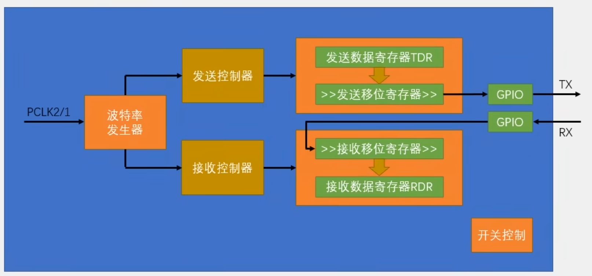

## 介绍

### 什么是USART

- USART: Universal synchronous asynchronous reciever and transmitter
- 可以在单片机或者电脑之间简单的发送/接受一串数据
- 同步/异步：指有无时钟线
- 三根线：TX RX GND
- 全双工：可以同时、双向地收发数据

> 教程：
>
> - 串口协议介绍 https://www.bilibili.com/video/BV1th411z7sn?p=25
> - stm32串口外设介绍 https://www.bilibili.com/video/BV1th411z7sn?p=26
> - STM32F4 HAL手册 UM1725

### 架构

 

> HAL库已经封装了发送和接收细节上的逻辑，不需要手动完成，仅了解即可

- **DR**数据寄存器，同一个地址，硬件上实际分为两个
  - **TDR** 1byte<u>发送数据寄存器</u>，向DR写入时写入到TDR
  - **RDR** 1byte<u>接收数据寄存器</u>，从DR读取时实际从RDR读取
- 标志位
  - **TXE** 发送寄存器空，表示可以写入数据了，写TDR自动置1，TDR被转移到移位寄存器自动置0
  - **RXNE** 接收寄存器非空，表示可以读取数据了，串口输入从移位寄存器转移到RDR自动置1，读RDR自动置0
- 中断事件
  - 可以在在发送/接收完一个字节，或是接收总线空闲时产生中断
  - 使用HAL库时，发送/接收完一整个Buffer，HAL库自动调用回调函数


### 语法

UART有**三种收发方式**：

- 阻塞模式：库函数在前台处理收发，阻塞用户代码运行，直到任务完成或超时返回。
- 中断模式：库函数在后台处理收发，每收发一个字节就进入中断，库函数在后台自动处理中断，任务完成后自动调用用户自定义的回调函数
- DMA模式：后续介绍。使用DMA(Direct Memory Access)搬运数据，不需要频繁进入中断，提高运行性能

```c
/*阻塞收发函数*/

// 以阻塞的方式发送，库函数在前台处理发送，缓冲区发送完 或 超时后退出
HAL_StatusTypeDef HAL_UART_Transmit(UART_HandleTypeDef *huart, uint8_t *pData, uint16_t Size, uint32_t Timeout);

// 以阻塞的方式接收，库函数在前台处理接受，缓冲区接收满 或 超时后退出
HAL_StatusTypeDef HAL_UART_Receive(UART_HandleTypeDef *huart, uint8_t *pData, uint16_t Size, uint32_t Timeout);

// 以阻塞的方式接收，库函数在前台处理接收，空闲 或 缓冲区接收满 或 超时后退出
HAL_StatusTypeDef HAL_UARTEx_ReceiveToIdle(UART_HandleTypeDef *huart, uint8_t *pData, uint16_t Size, uint16_t *RxLen, uint32_t Timeout);

/* 中断收发函数 */

// 以中断的方式接收，每收到一个字节就进入RXNE中断，库函数在后台自动处理中断，缓冲区收满 自动调用接收完毕回调函数
HAL_StatusTypeDef HAL_UART_Receive_IT(UART_HandleTypeDef *huart, uint8_t *pData, uint16_t Size);

// 以中断的方式接收，每收到一个字节就进入RXNE中断，库函数在后台自动处理中断，空闲 或 缓冲区收满 等事件自动调用UARTEx事件回调函数
HAL_StatusTypeDef HAL_UARTEx_ReceiveToIdle_IT(UART_HandleTypeDef *huart, uint8_t *pData, uint16_t Size);

/* 回调函数 */

// 接收完毕回调函数，如果连续接收要在此重新开始接收
__weak void HAL_UART_RxCpltCallback(UART_HandleTypeDef *huart){}

// UARTEx事件回调函数，如果连续接收要在此重新开始接收，具体什么事件会调用请参考HAL手册
__weak void HAL_UARTEx_RxEventCallback(UART_HandleTypeDef *huart, uint16_t Size){}

// 查询是什么事件触发了UARTEx回调函数
HAL_UART_RxEventTypeTypeDef HAL_UARTEx_GetRxEventType (UART_HandleTypeDef * huart);
```

> 接收函数（比如Receive或Receive_IT）如果缓冲区太小，数据量大的时候会卡死。原因：
>
> - https://blog.csdn.net/m0_37545528/article/details/122886020
> - https://blog.csdn.net/zhang062061/article/details/112987393
>
> 可以设置大一点的缓冲区然后用`HAL_UARTEx_ReceiveToIdle_IT` 或改用DMA

## 实践：阻塞模式收发

### 目标

使用阻塞模式，电脑发送数据给STM32，STM32从串口接收数据后马上原样从串口发送出去

### 配置CubeMX

可以把第一个空项目的.ioc文件复制出来改个名字再配置，不用每次都调那几个基本参数

我这里用`USART1`来测试

- 最左侧外设列表 `Connectivity` -> `USART1`
  - 中间上方`Mode` -> 选择`Asynchronous`，即异步收发，UART模式
  - 中间下方`Configuration` -> `Parameter Settings`页面 -> 设置波特率`Baud Rate`，这里我们选择较为通用的`115200`

- 其他保持默认即可

### 代码

```c
  /* Infinite loop */
  /* USER CODE BEGIN WHILE */
    // 缓冲区
    uint8_t data[100]={0};
    // 已接收数据大小
    uint16_t rxlen;
  while (1)
  {
      // 接收数据到data
      HAL_UARTEx_ReceiveToIdle(&huart1, data, sizeof(data), &rxlen, HAL_MAX_DELAY);
      // 原样发送数据
      HAL_UART_Transmit(&huart1, data, rxlen, 1000);
    /* USER CODE END WHILE */

    /* USER CODE BEGIN 3 */
  }
  /* USER CODE END 3 */
```

### 运行

电脑上需要下载串口调试工具，网络上有很多这类的工具，比如Termius, Putty，我随便在微软商店上下载了“串口调试助手”

根据原理图，连接stm32和电脑的串口（外置CH340模块，或者下载器上自带串口），记得连接三根线并且TX,RX交叉连接

通过串口调试工具调试，随意发送一些数据，应该可以看到发送的数据被原样回传。

但是当一次发送的数据量超过data buffer的大小时会出现问题，表现为100bytes后面的数据会被丢弃。因为收到100字节之后，程序被阻塞在`HAL_UART_Transmit`以发送数据，RDR寄存器只有1byte，在发送过程中收到的数据 因为程序没有从寄存器及时取出 而被覆盖丢弃了。

## 实践：中断模式收发

### 目标

使用中断模式，电脑发送数据给STM32，STM32从串口接收数据后马上原样从串口发送出去

### 配置CubeMX

- 最左侧外设列表 `Connectivity` -> `USART1` -> 中间下方`Configuration` -> `NVIC Settings`页面 -> 勾选`USART1 global interrupt`以启用中断

### 代码

在`main`函数前面添加 全局变量定义 和 回调函数定义

```c
/* Private user code ---------------------------------------------------------*/
/* USER CODE BEGIN 0 */

// 把buffer和data都定义为全局变量
uint8_t rxbuf[100]={0}; // 一级缓冲
uint8_t data[100]={0}; // 二级缓冲
volatile uint8_t rxlen=0; // 接收内容长度

// 定义回调函数
void HAL_UARTEx_RxEventCallback(UART_HandleTypeDef *huart, uint16_t Size)
{
    memcpy(data,rxbuf,Size); // 迅速把缓冲区的数据复制出来，避免马上到来的数据将其覆盖
    rxlen = Size; // 收到的数据长度
    HAL_UARTEx_ReceiveToIdle_IT(huart,rxbuf,sizeof(rxbuf)); // 重新开启接收
}
/* USER CODE END 0 */
```

在`while`循环里添加数据发送的代码

```c
  /* Infinite loop */
  /* USER CODE BEGIN WHILE */

    HAL_UARTEx_ReceiveToIdle_IT(&huart1,rxbuf,sizeof(rxbuf)); // 开启中断
  while (1)
  {
      if (rxlen > 0) // 如果有接收到数据
      {
          uint8_t tmp=rxlen;
          rxlen = 0;
          HAL_UART_Transmit(&huart1, data, tmp, 1000); // 原样发送数据
      }
    /* USER CODE END WHILE */

    /* USER CODE BEGIN 3 */
  }
  /* USER CODE END 3 */
```

> 不在回调函数中调用`HAL_UART_Transmit`发送数据，因为阻塞式发送数据消耗较长的时间，需要避免在中断函数中消耗较长时间。

### 运行

在我这里测试，发送大量数据也没有观察到错误或者数据丢失。改用921600的波特率也没有问题。

## 实践：DMA模式收发

参考HAL库完成

Todo...