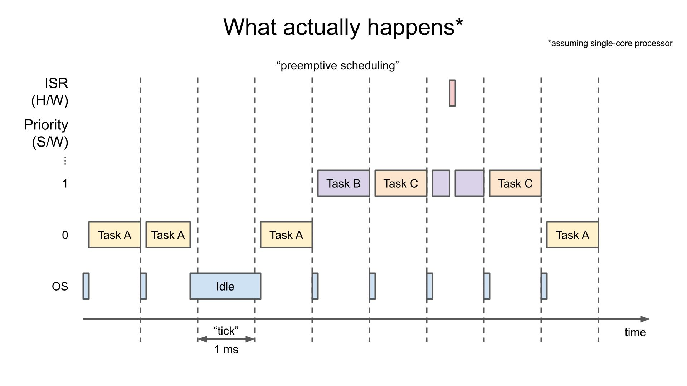

## 介绍

### 关于本文

- 这是 `Introduction to RTOS` 的笔记/思维导图，主要记录一些看视频中产生的疑惑和基础用法

- 原视频链接：  
  https://www.youtube.com/watch?v=Qske3yZRW5I&list=PLEBQazB0HUyQ4hAPU1cJED6t3DU0h34bz
- 原文链接：  
  https://www.digikey.com/en/maker/projects/what-is-a-realtime-operating-system-rtos/28d8087f53844decafa5000d89608016
- FreeRTOS开发者文档：  
  https://freertos.org/zh-cn-cmn-s/features.html

## 基本使用

### 新建任务

task函数的声明

```cpp
void task1(void *parameter);
```

对于单核处理器

```cpp
xTaskCreate(
    task1,   /* Task function. */
    "Task1", /* name of task. */
    2048,    /* Stack size of task */
    NULL,    /* parameter of the task */
    1,       /* priority of the task */
    NULL);   /* Task handle to keep track of created task */
```

对于Arduino上的ESP32，额外多出PinnedToCore功能

```cpp
xTaskCreatePinnedToCore(
    task1,   /* Task function. */
    "Task1", /* name of task. */
    2048,    /* Stack size of task */
    NULL,    /* parameter of the task */
    1,       /* priority of the task */
    NULL,    /* Task handle to keep track of created task */
    1);      /* pin task to core 1 */
```

### 任务传参

- 只能传指针
- 可以考虑传参数struct的指针
- 需要考虑指针所指向的struct对象的生存期，不然还没进入task就释放了参数对象，task读取不到
- 可以考虑用Semaphore信号量延迟调用创建task语句的函数的返回

```cpp
typedef struct
{
    int a;
    SemaphoreHandle_t &semaphore;
} task1_param;

// setup()
task1_param param1 = {1, semaphore};
xTaskCreatePinnedToCore(
    task1,   /* Task function. */
    "Task1", /* name of task. */
    2048,    /* Stack size of task */
    &param1, /* parameter of the task */
    1,       /* priority of the task */
    NULL,    /* Task handle to keep track of created task */
    1);      /* pin task to core 1 */
xSemaphoreTake(semaphore, portMAX_DELAY);

// task1()
task1_param param = *(task1_param *)parameter;
xSemaphoreGive(param.semaphore);
```

### 延迟

```cpp
// 原始定义
vTaskDelay(<要延迟的tick数>);

// 按毫秒算
vTaskDelay(<要延迟的ms数> / portTICK_PERIOD_MS);
```

### 软件定时器

- 不受硬件定时器数量限制
- 精度为FreeRTOS的Tick大小
- 所有定时器共享一个task
- 控制定时器时，将指令发送到队列，定时器总的task读取指令进行操作

```cpp
// 回调函数
void TimerCallback(TimerHandle_t xTimer)
{
    uint32_t timerid = (uint32_t)pvTimerGetTimerID(xTimer);
    Serial.printf("TimerCallback (id = %d)\n", timerid);
}

// 创建定时器
TimerHandle_t timer1;

timer1 = xTimerCreate(
    "timer1",            // Name
    pdMS_TO_TICKS(1000), // Period in ticks
    pdTRUE,              // Auto-reload
    (void *)0,           // Timer ID
    TimerCallback);      // Callback function

if (timer1 == NULL)
{
    Serial.println("Error creating timer1");
    vTaskDelay(portMAX_DELAY);
}

// 两条命令作用一样，发送命令到操作队列
// 定时器未启动则启动，已启动则重新计时
xTimerStart(timer1, portMAX_DELAY);
xTimerReset(timer1, portMAX_DELAY);
```

## 任务调度

### 任务状态


四个状态：

- `Ready`
  - 就绪，任何时候都可以开始运行
  - 如果没有更高级别的task就绪，那么将执行该task
- `Running`
  - 正在运行
- `Blocked`
  - 阻塞
  - 任务通过阻塞来等待队列、信号、通知等事件
  - 通常有阻塞Timeout
  - task中的代码可以调用阻塞
- `Suspended`
  - 暂停/挂起
  - 除非使用Resume函数，否则不会运行
  - 本task或其他task都可以操作暂停和恢复此task

### 任务调度



一些概念

- `Time Slicing` (时间片)
  - 通过硬件定时器将时间分片，供不同task使用
- `Tick` 
  - 时间单位，一个时间片的长度
  - 在ESP32 Arduino中默认是1ms
- `Priority` (优先级)
  - 每个任务的优先级可以为`0`~`(configMAX_PRIORITIES - 1)`
  - 数字越大优先级越高，`IDLE`任务的优先级为0

将会调用调度程序的操作

- 每一tick的硬件定时器被触发
- 任务被阻塞（等待延时/队列/互斥锁/信号量等）
- 任务主动让出（调用yield函数）
- 队列/互斥锁/信号量被改变

### 调度策略

- 延迟调度决策
  - FreeRTOS不会延迟调度决策
  - 开启后，一个tick中，一个task提前完成所有任务并进入了阻塞或主动让出，**剩下的时间将不会被利用**，下一次调度将发生在下一tick开始时（取消任务阻塞/让出后 不会立即重新调度）
- 优先级调度
  - 进行调度程序时，始终让高优先级任务先运行
  - 硬件中断函数(ISR)的优先级高于一切任务
- 抢占式/协同式调度 [`configUSE_PREEMPTION`](https://freertos.org/zh-cn-cmn-s/a00110.html#configUSE_PREEMPTION)
  - 抢占式调度：低优先级线程取消了高优先级线程阻塞后，高优先级线程立即抢占cpu时间并开始运行（取消高优先级任务阻塞 立即重新调度）(默认)
  - 协同式调度：低优先级线程取消了高优先级线程阻塞后，直到低优先级线程主动让出或超时（取消高优先级任务阻塞 不重新调度）
- 时间片轮询 [`configUSE_TIME_SLICING`](https://freertos.org/zh-cn-cmn-s/a00110.html#configUSE_TIME_SLICING)
  - 开启后，将在每个tick的中断时在同等优先级任务之间切换 (默认)
  - 关闭后，每个tick的中断时仍运行优先级最高的任务，但不会在相同优先级的任务之间切换。

### 一些函数

- `taskYIELD()` 主动让出处理器时间，让freertos重新调度 (`yield()`)

### 优先级继承

如果没有优先级继承，理想中是这样的


实际上是这样的


高优先级的Task H由于需要Task L的锁而进入阻塞。而Task M抢占了Task L，导致Task L不能及时释放锁，高优先级的Task H不能运行。

低优先级的Task M导致高优先级的Task H不能运行，这是不合理的。这被称为优先级反转问题。

> ChatGPT: 优先级反转问题在多任务系统中出现，其中一个较低优先级的任务持有某个资源，并且一个较高优先级的任务需要访问该资源。如果在较低优先级任务的持有期间，有一个中优先级的任务处于就绪状态，那么该中优先级任务可能会在较高优先级任务前获得执行。


所以需要优先级继承机制。把Task L提高到Task H的优先级，以避免上述情况

### 硬件中断


- 硬件中断的优先级高于一切任务
- 硬件中断**持续时间应该尽量短**，不应该被阻塞，所以不能等待队列、互斥锁或信号量

在硬件中断中调用FreeRTOS函数：

- 需要调用以`FromISR`结尾的函数，一般的函数 都额外定义了 可以在中断中使用的版本，这些函数不会阻塞中断运行

- `FromISR`函数一般会多出`pxHigherPriorityTaskWoken`参数（输出，不是输入），如果调用`xxxFromISR()`函数会**造成高优先级任务阻塞解除**，那么该参数将被函数设置为`True`。

- 如果为`True`，可以在中断结尾**显式的请求重新调度**
```cpp
// 中断函数中
BaseType_t task_woken = pdFALSE;

// task_woken被设置
xSemaphoreGiveFromISR(semaphore, &task_woken);

// 在中断函数结尾处
portYIELD_FROM_ISR(task_woken);
// 或
if (task_woken==pdTRUE)
    portYIELD_FROM_ISR();
// 该函数将结束中断并显式的请求重新调度
```

SpinLock停止硬件中断 (*在esp32中可用)

- 修改全局变量时，可以用SpinLock停止硬件中断以保护critical session

- 在硬件中断中使用SpinLock停止硬件中断，可以防止中断嵌套

- 在软件任务中使用SpinLock停止硬件中断，可以防止读写数据时被硬件中断修改

- SpinLock和Mutex类似，但是它适合在极短时间内保护资源（比如读写变量）

- 在ESP32中可用，STM32中可能需要通过设置*中断屏蔽寄存器*来屏蔽中断

  > ChatGPT: 当一个线程获取自旋锁时，它会首先屏蔽中断，然后尝试获取锁。如果锁不可用，线程会进入自旋等待。在自旋等待期间，如果有中断发生，由于中断被屏蔽，中断处理程序将不会被执行。这样可以确保在获取锁之前，中断处理程序不会干扰临界区的执行。

```cpp
portMUX_TYPE spinlock = portMUX_INITIALIZER_UNLOCKED;

portENTER_CRITICAL_ISR(&spinlock);
// 修改某些全局变量
portEXIT_CRITICAL_ISR(&spinlock);
```

### 任务饥饿

描述：高优先级任务长期占用某种资源（CPU时间/互斥锁等），导致低优先级任务始终阻塞或得不到CPU运行时间

解决方案：

1. 对于多核mcu，让高优先级任务和低优先级任务运行在不同内核上
2. 让高优先级任务阻塞，比如运行完delay一段时间，或阻塞直到收到消息
3. Aging：如果低优先级任务得不到运行，逐渐提高其优先级直到其运行（需要自己实现）

### 任务死锁

情景：任务A和B都分别需要锁A和B。任务A先取了锁A，任务B先取了锁B，任务无法获取锁B，任务B无法获取锁A。

解决方案：

1. 设置一个mutex，让同时只能有一个task访问所有共享资源（靠谱但效率低下）
2. 设置获取不到锁的最长阻塞时间，超时后释放所有自己已经拿的锁（不靠谱，延迟同步后可能会出现Live Lock）
3. 把所有共享的资源编号，所有task按编号从小到大取资源

## 任务间协作

### Queue(队列)

- 可以储存数据本身，而不是引用
- 队列为满时，发送端可以选择阻塞
- 队列为空时，接收端可以选择阻塞
- 个人感觉更适合**多个task发送，一个task接收**

```cpp
// 定义队列handle
QueueHandle_t msg_queue;

//在堆中新建队列
msg_queue = xQueueCreate(<length>, sizeof(msg_t));

//写入，成功返回pdTRUE
xQueueSend(<队列handle>, <输入消息指针>, <等待tick>);
xQueueSend(msg_queue, &msg, 1000 / portTICK_PERIOD_MS);

//读取，成功返回pdTRUE
xQueueReceive(<队列handle>, <输出消息指针>, <等待tick>);
xQueueReceive(msg_queue, &msg, 1000 / portTICK_PERIOD_MS);
```

### Mutex(互斥锁)

- 可以对某种 同时只能由一个进程使用的资源 上锁（比如内存、外设等）
- 有两种状态：上锁和解锁
- 资源被一个task锁定，只能由这个task解锁
- 访问锁定的资源时，可以选择阻塞
- 有**优先级反转**功能
- 个人感觉更适合**多个task访问同一资源**
- 实际上用队列实现

```cpp
// 定义互斥锁handler
SemaphoreHandle_t mutex;

// 在堆中新建互斥锁
mutex = xSemaphoreCreateMutex();

// 上锁
xSemaphoreTake(mutex, 200 / portTICK_PERIOD_MS);

// 解锁
xSemaphoreGive(mutex);
```

### Semaphore(信号量)

- 可以对某种 同时最多由n个进程使用的资源 上锁
- 感觉比较像**用Mutex保护的单个计数变量**
- 可以用在创建进程时，确保所有进程都已经读取了传入的参数
- 可以用在保护自定义的buffer，使写入满的buffer时不需要轮询来等待空位
  （评价是不如使用queue）
- 实际用队列实现

```cpp
// 定义信号量handler
SemaphoreHandle_t semaphore;

// 在堆中新建信号量
semaphore = xSemaphoreCreateCounting(<最大值>, <初始值>); //计数信号量
semaphore = xSemaphoreCreateBinary(); //二进制信号量

// 减少信号量
xSemaphoreTake(semaphore, 200 / portTICK_PERIOD_MS);

// 增加信号量
xSemaphoreGive(semaphore);
```

### Mutex和Semaphore对比

- Mutex
  - 锁被一个Task锁拥有，强调锁的所有权
  - 有优先级继承，适合用在task之间
- Semaphore
  - 更适合用在中断中，避免优先级继承

## 内存管理

### 内存布局


一些名词

- `TCB`: Task Control Block，包括任务名、任务状态、优先级、栈顶指针等信息
- `Kernel Object`: 内核对象，包括**任务**、队列、互斥锁等

每个task都需要一块内存，作为栈空间和TCB使用

系统在栈空间底部添加了一段特殊内容，通过定时检测特殊内容是否改变来确定来确保task没有发生栈溢出

### 内核内存分配

FreeRTOS中**内核对象**需要的内存有两种分配方式
- 动态分配内存：在系统总堆上动态分配，可以被释放以节省内存
- 静态分配内存：在静态内存区分配，可以在编译时确定最大内存使用量

  ```cpp
  //新建动态分配内存的任务
  xTaskCreate();
  //新建静态分配内存的任务
  xTaskCreateStatic();
  //新建动态分配内存的任务
  xQueueCreate();
  //新建静态分配内存的任务
  xQueueCreateStatic();
  ```

  > 一般通过在后面加Static来静态分配内存

### 用户堆内存分配

FreeRTOS实现了多个等级的内存分配`malloc()`和释放`free()`

https://freertos.org/zh-cn-cmn-s/a00111.html

> - [heap_1](https://freertos.org/zh-cn-cmn-s/a00111.html#heap_1) —— 最简单，不允许释放内存。
> - [heap_2](https://freertos.org/zh-cn-cmn-s/a00111.html#heap_2) —— 允许释放内存，但不会合并相邻的空闲块。
> - [heap_3](https://freertos.org/zh-cn-cmn-s/a00111.html#heap_3) —— 简单包装了标准 malloc() 和 free()，以保证线程安全。
> - [heap_4](https://freertos.org/zh-cn-cmn-s/a00111.html#heap_4) —— 合并相邻的空闲块以避免碎片化。 包含绝对地址放置选项。
> - [heap_5](https://freertos.org/zh-cn-cmn-s/a00111.html#heap_5) —— 如同 heap_4，能够跨越多个不相邻内存区域的堆。

```cpp
// malloc()
void* pvPortMalloc(size_t xWantedSize);

// free()
void vPortFree(void* p);
```

### 调试输出

剩余栈空间

- 输出xTask历史上占用栈空间最多时 所剩下的栈空间（参数为NULL时表示当前任务）
- 返回值以byte为单位（仅对于我的版本而言）
- 有的FreeRTOS中返回值以word(4 bytes)为单位。详情查看声明文件注释。

```cpp
UBaseType_t uxTaskGetStackHighWaterMark(TaskHandle_t xTask);
```

剩余堆空间

- 返回值以byte为单位

```cpp
uint32_t xPortGetFreeHeapSize();
```

## 在STM32中运行

> 此部分适合使用CubeMX开发STM32，参考前面的开发环境搭建有关的文章。

### 启用FreeRTOS

Todo

### 相关文件

- `Core/Inc/FreeRTOSConfig.h`: FreeRTOS配置文件，其中属性需要在CubeMX中图形化配置
- `Core/Inc/main.c`: 芯片上电时执行的`main`函数，在初始化结束时把执行权限交给FreeRTOS调度器，后面的`while (1)`部分不会运行，开启FreeRTOS后我们不应该在此处写代码
- `Core/Src/freertos.c`: 默认生成的`DefaultTask`函数，我们应该从这里的任务函数开始写代码。这个函数是`weak`弱定义的，可以在别处重新定义函数以覆盖。

### C和C++混合编译问题

我们RM的主项目中使用了CMake将C和C++混合编译，如果要在`cpp`文件中使用在`c`文件中定义的函数，需要**在公共的头文件中使用`extern C`关键字标注函数的声明**，否则会链接不到

> 被坑了被坑了
>
> 服了，折腾了一周才弄明白，前任的教学有些不到位呢~
